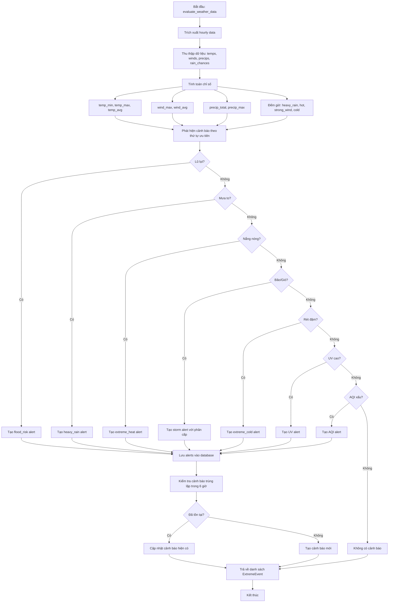
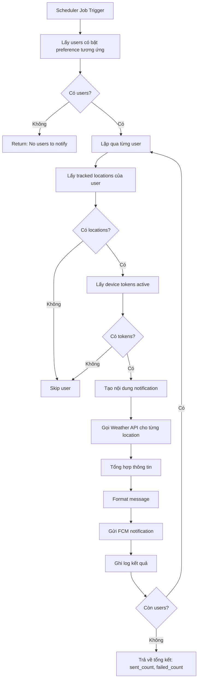
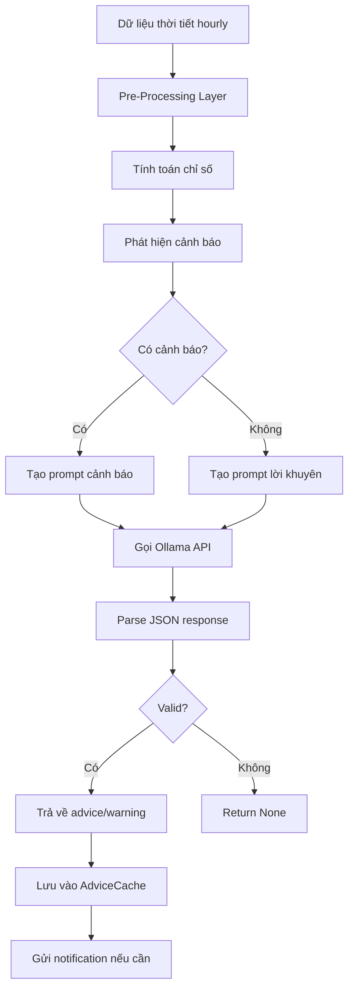
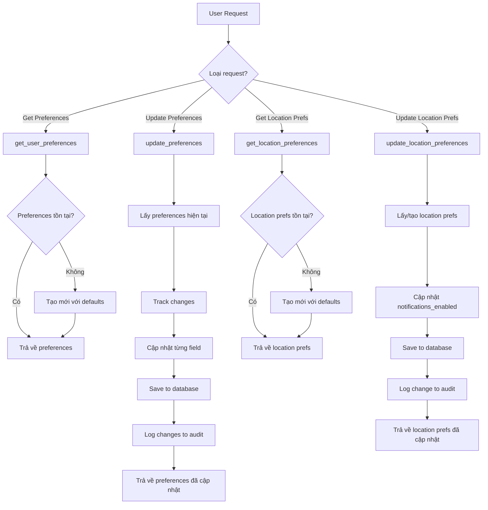
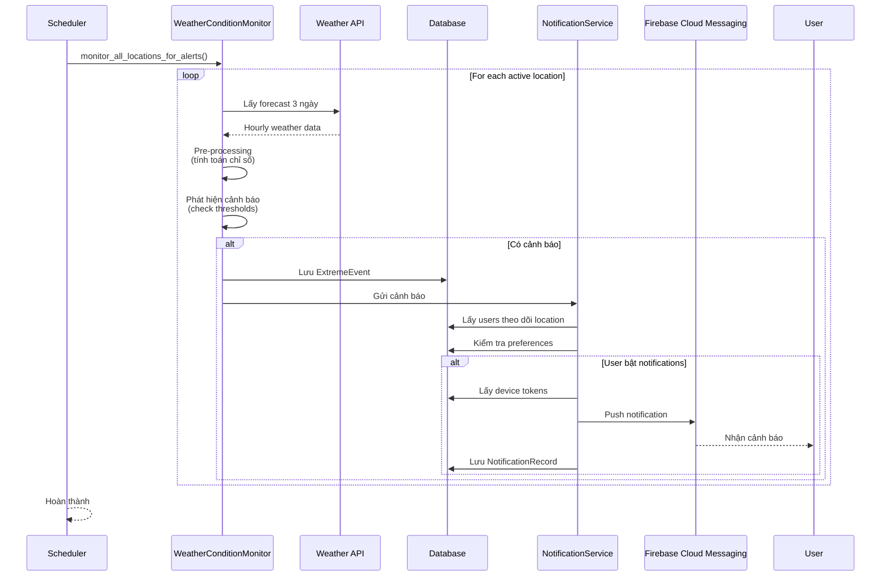
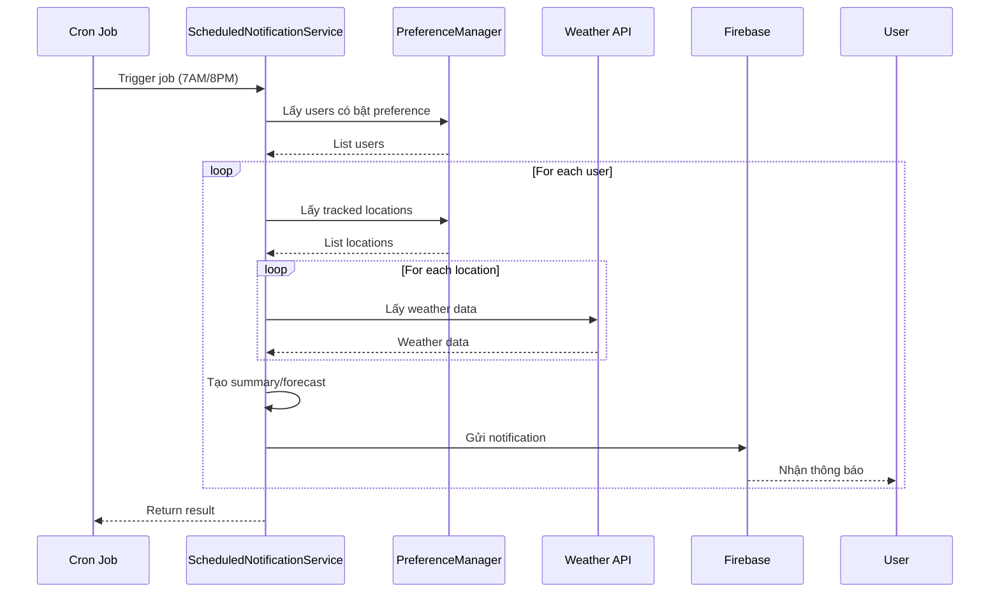
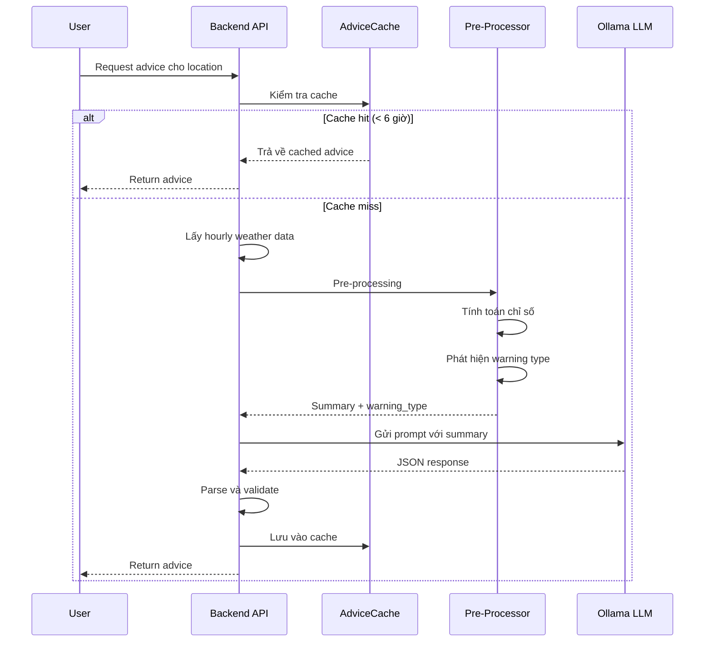
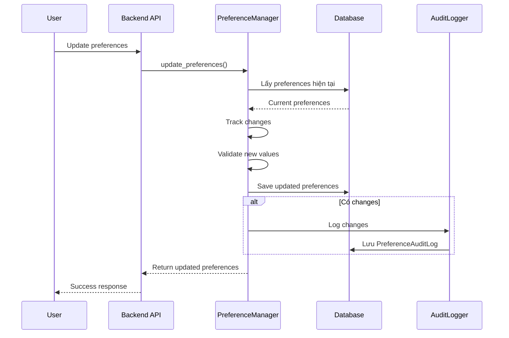

# Tài Liệu Thuật Toán Backend

## 📋 Mục lục

- [Tổng Quan](#tổng-quan)
- [1. Weather Monitoring Algorithm](#1-weather-monitoring-algorithm)
  - [1.1. Mục Đích](#11-mục-đích)
  - [1.2. Ngưỡng Cảnh Báo](#12-ngưỡng-cảnh-báo)
  - [1.3. Luồng Xử Lý](#13-luồng-xử-lý)
  - [1.4. Logic Phát Hiện Chi Tiết](#14-logic-phát-hiện-chi-tiết)
  - [1.5. Quản Lý Cảnh Báo Trùng Lặp](#15-quản-lý-cảnh-báo-trùng-lặp)
- [2. Notification Scheduling Logic](#2-notification-scheduling-logic)
  - [2.1. Mục Đích](#21-mục-đích)
  - [2.2. Luồng Xử Lý Chung](#22-luồng-xử-lý-chung)
  - [2.3. Morning Summary](#23-morning-summary-700-am)
  - [2.4. Tomorrow Forecast](#24-tomorrow-forecast-800-pm)
  - [2.5. Weekly Summary](#25-weekly-summary-800-pm-sunday)
  - [2.6. Xử Lý Lỗi và Retry](#26-xử-lý-lỗi-và-retry)
- [3. AI Advice Generation Process](#3-ai-advice-generation-process)
  - [3.1. Mục Đích](#31-mục-đích)
  - [3.2. Kiến Trúc Tổng Quan](#32-kiến-trúc-tổng-quan)
  - [3.3. Pre-Processing Logic](#33-pre-processing-logic)
  - [3.4. Prompt Engineering](#34-prompt-engineering)
  - [3.5. Gọi Ollama API](#35-gọi-ollama-api)
  - [3.6. Response Format](#36-response-format)
  - [3.7. Xử Lý Lỗi](#37-xử-lý-lỗi)
  - [3.8. Caching Strategy](#38-caching-strategy)
- [4. Preference Management Logic](#4-preference-management-logic)
  - [4.1. Mục Đích](#41-mục-đích)
  - [4.2. Kiến Trúc](#42-kiến-trúc)
  - [4.3. Default Values](#43-default-values)
  - [4.4. Get User Preferences](#44-get-user-preferences)
  - [4.5. Update Preferences với Audit Logging](#45-update-preferences-với-audit-logging)
  - [4.6. Location-Specific Preferences](#46-location-specific-preferences)
  - [4.7. Audit Logging](#47-audit-logging)
  - [4.8. Error Handling](#48-error-handling)
  - [4.9. Validation Rules](#49-validation-rules)
- [5. Tích Hợp Các Thuật Toán](#5-tích-hợp-các-thuật-toán)
- [6. Performance Considerations](#6-performance-considerations)
- [7. Monitoring và Logging](#7-monitoring-và-logging)
- [8. Tài Liệu Tham Khảo](#8-tài-liệu-tham-khảo)

## Tổng Quan

Document này mô tả chi tiết các thuật toán phức tạp được sử dụng trong hệ thống backend Weather Forecast. Các thuật toán này bao gồm:

1. **Weather Monitoring Algorithm** - Giám sát điều kiện thời tiết và phát hiện cảnh báo
2. **Notification Scheduling Logic** - Lập lịch và gửi thông báo định kỳ
3. **AI Advice Generation Process** - Tạo lời khuyên thông minh bằng AI
4. **Preference Management Logic** - Quản lý preferences người dùng

---

## 1. Weather Monitoring Algorithm

### 1.1. Mục Đích

Thuật toán giám sát thời tiết (`WeatherConditionMonitor`) được thiết kế để:
- Phân tích dữ liệu thời tiết theo giờ từ API
- Phát hiện các điều kiện nguy hiểm dựa trên ngưỡng định trước
- Tạo cảnh báo với mức độ nghiêm trọng phù hợp
- Lưu cảnh báo vào database và gửi thông báo cho người dùng

### 1.2. Ngưỡng Cảnh Báo (THRESHOLDS)

Hệ thống sử dụng các ngưỡng được định nghĩa rõ ràng cho từng loại cảnh báo:

#### Nguy Cơ Lũ Lụt (Flood Risk)
- **Cực kỳ nguy hiểm**: Tổng lượng mưa > 150mm trong 3 ngày
- **Nguy hiểm cao**: Tổng lượng mưa > 100mm HOẶC (mưa to >= 6 giờ VÀ tổng > 50mm)
- **Nguy hiểm trung bình**: Tổng lượng mưa > 50mm
- **Mưa to**: Lượng mưa > 10mm/giờ

#### Mưa To (Heavy Rain)
- **Lượng mưa tối đa**: > 20mm/giờ
- **Số giờ mưa to**: >= 3 giờ
- **Khả năng mưa cao**: >= 4 giờ với xác suất > 70%

#### Nắng Nóng Cực Đoan (Extreme Heat)
- **Cực kỳ nguy hiểm**: Nhiệt độ > 39°C
- **Nguy hiểm cao**: Nhiệt độ > 35°C
- **Số giờ nóng**: >= 4 giờ liên tục


#### Bão/Gió Mạnh (Storm/Strong Wind)

Phân cấp theo tiêu chuẩn quốc tế Saffir-Simpson:

- **Siêu bão (Super Typhoon)**: >= 185 km/h - Category 5
- **Bão mạnh (Typhoon)**: 118-184 km/h - Category 3-4
- **Bão nhiệt đới (Tropical Storm)**: 63-117 km/h - Category 1-2
- **Áp thấp nhiệt đới (Tropical Depression)**: 39-62 km/h
- **Gió mạnh (Strong Wind)**: >= 50 km/h
- **Gió vừa (Moderate Wind)**: >= 40 km/h
- **Số giờ gió mạnh**: >= 3 giờ liên tục

#### Rét Đậm (Extreme Cold)
- **Cực kỳ lạnh**: Nhiệt độ < 5°C
- **Lạnh cao**: Nhiệt độ < 10°C
- **Số giờ lạnh**: >= 6 giờ liên tục

#### Chỉ Số UV (UV Index)

Phân cấp theo WHO:

- **Cực kỳ nguy hiểm (Extreme)**: >= 11
- **Rất cao (Very High)**: 8-10
- **Cao (High)**: 6-7
- **Trung bình (Moderate)**: 3-5
- **Thấp (Low)**: 0-2
- **Số giờ nguy hiểm**: >= 3 giờ liên tục

#### Chất Lượng Không Khí (Air Quality Index)

Phân cấp theo US EPA:

- **Nguy hại (Hazardous)**: >= 301 - Maroon
- **Rất không tốt (Very Unhealthy)**: 201-300 - Purple
- **Không tốt (Unhealthy)**: 151-200 - Red
- **Không tốt cho nhóm nhạy cảm**: 101-150 - Orange
- **Trung bình (Moderate)**: 51-100 - Yellow
- **Tốt (Good)**: 0-50 - Green

### 1.3. Luồng Xử Lý (Flow)




### 1.4. Logic Phát Hiện Chi Tiết

#### Phát Hiện Lũ Lụt (`_check_flood_risk`)

```python
# Ưu tiên cao nhất - kiểm tra trước tiên
if precip_total > 150:  # Cực kỳ nguy hiểm
    severity = 'EXTREME'
    message = f'NGUY CƠ LŨ LỤT CỰC KỲ CAO! Tổng lượng mưa: {precip_total}mm'
    advice = 'KHẨN CẤP: Sơ tán ngay nếu ở vùng trũng'
    
elif precip_total > 100 OR (heavy_rain_hours >= 6 AND precip_total > 50):
    severity = 'HIGH'
    message = f'Nguy cơ lũ lụt cao. Tổng lượng mưa: {precip_total}mm'
    advice = 'Chuẩn bị sơ tán nếu ở vùng trũng'
```

**Lý do ưu tiên**: Lũ lụt là mối nguy hiểm nghiêm trọng nhất, cần cảnh báo sớm nhất.

#### Phát Hiện Bão (`_check_storm_level`)

Phân cấp theo tốc độ gió tối đa:

```python
if wind_max >= 185:  # Siêu bão Category 5
    severity = 'EXTREME'
    impact_field = 'super_typhoon'
    advice = 'KHẨN CẤP: Sơ tán ngay lập tức!'
    
elif wind_max >= 118:  # Bão mạnh Category 3-4
    severity = 'EXTREME'
    impact_field = 'typhoon'
    advice = 'KHẨN CẤP: Gia cố nhà cửa ngay. Chuẩn bị sơ tán'
    
elif wind_max >= 63:  # Bão nhiệt đới Category 1-2
    severity = 'HIGH'
    impact_field = 'tropical_storm'
    advice = 'Gia cố nhà cửa. Hạn chế ra ngoài'
    
elif wind_max >= 39:  # Áp thấp nhiệt đới
    severity = 'HIGH'
    impact_field = 'tropical_depression'
    advice = 'Cẩn thận khi ra ngoài. Gia cố vật dụng dễ bay'
    
elif wind_max >= 50 OR strong_wind_hours >= 3:  # Gió mạnh
    severity = 'MEDIUM'
    impact_field = 'strong_wind'
    advice = 'Cẩn thận khi di chuyển. Tránh đứng dưới cây'
```

#### Phát Hiện UV Nguy Hiểm (`_check_uv_index`)

```python
# Lấy UV values từ hourly data
uv_values = [h.get('uv', 0) for h in hourly_data]
uv_max = max(uv_values)
dangerous_uv_hours = count(uv >= 8)

if uv_max >= 11:  # Cực kỳ nguy hiểm
    severity = 'HIGH'
    impact_field = 'extreme_uv'
    advice = 'CẢNH BÁO: Tránh ra ngoài 10h-16h. SPF 50+'
    
elif uv_max >= 8:  # Rất cao
    severity = 'HIGH'
    impact_field = 'very_high_uv'
    advice = 'Hạn chế ra ngoài 10h-16h. SPF 30+'
    
elif uv_max >= 6 AND dangerous_uv_hours >= 3:  # Cao
    severity = 'MEDIUM'
    impact_field = 'high_uv'
    advice = 'Dùng kem chống nắng SPF 30. Đội mũ'
```

#### Phát Hiện Chất Lượng Không Khí (`_check_air_quality`)

```python
# Lấy AQI từ air_quality field
aqi_values = [h.get('air_quality', {}).get('us-epa-index') for h in hourly_data]
aqi_max = max(aqi_values)
unhealthy_hours = count(aqi >= 101)

if aqi_max >= 301:  # Nguy hại
    severity = 'EXTREME'
    impact_field = 'hazardous_aqi'
    advice = 'KHẨN CẤP: Ở trong nhà. Đeo khẩu trang N95'
    
elif aqi_max >= 201:  # Rất không tốt
    severity = 'HIGH'
    impact_field = 'very_unhealthy_aqi'
    advice = 'Hạn chế ra ngoài. Đeo khẩu trang N95'
    
elif aqi_max >= 151:  # Không tốt
    severity = 'HIGH'
    impact_field = 'unhealthy_aqi'
    advice = 'Hạn chế hoạt động ngoài trời. Đeo khẩu trang'
    
elif aqi_max >= 101 AND unhealthy_hours >= 3:  # Không tốt cho nhóm nhạy cảm
    severity = 'MEDIUM'
    impact_field = 'unhealthy_sensitive_aqi'
    advice = 'Người già, trẻ em nên hạn chế ra ngoài'
```

### 1.5. Quản Lý Cảnh Báo Trùng Lặp

Để tránh spam thông báo, hệ thống kiểm tra cảnh báo trùng lặp:

```python
# Kiểm tra cảnh báo tương tự trong 6 giờ qua
six_hours_ago = timezone.now() - timedelta(hours=6)
existing = ExtremeEvent.objects.filter(
    location=location,
    impact_field=alert['impact_field'],
    analysis_time__gte=six_hours_ago,
    is_active=True
).first()

if existing:
    # Cập nhật cảnh báo hiện có
    existing.severity = alert['severity']
    existing.forecast_details_vi = alert['forecast_details_vi']
    existing.actionable_advice_vi = alert['actionable_advice_vi']
    existing.analysis_time = timezone.now()
    existing.save()
else:
    # Tạo cảnh báo mới
    event = ExtremeEvent.objects.create(...)
```

**Lợi ích**:
- Tránh gửi nhiều thông báo giống nhau trong thời gian ngắn
- Cập nhật thông tin mới nhất cho cảnh báo đang active
- Giảm notification fatigue cho người dùng


---

## 2. Notification Scheduling Logic

### 2.1. Mục Đích

Hệ thống scheduled notifications (`ScheduledNotificationService`) cung cấp 3 loại thông báo định kỳ:
1. **Morning Summary** - Tóm tắt thời tiết buổi sáng (7:00 AM)
2. **Tomorrow Forecast** - Dự báo ngày mai (8:00 PM)
3. **Weekly Summary** - Tóm tắt tuần (8:00 PM Chủ nhật)

### 2.2. Luồng Xử Lý Chung



### 2.3. Morning Summary (7:00 AM)

#### Mục Đích
Cung cấp tóm tắt thời tiết hôm nay để người dùng chuẩn bị cho ngày mới.

#### Logic Chi Tiết

```python
def send_morning_summary():
    # 1. Lọc users có bật morning_summary_enabled
    users = NotificationPreferences.objects.filter(
        morning_summary_enabled=True
    )
    
    for user in users:
        # 2. Lấy locations user đang theo dõi
        tracked_locations = Location.objects.filter(
            users__contains=user.user_id,
            is_active=True
        )
        
        # 3. Lấy device tokens
        tokens = DeviceToken.objects.filter(
            user_id=user.user_id,
            is_active=True
        )
        
        # 4. Tạo nội dung summary
        summary = generate_morning_summary(tracked_locations)
        
        # 5. Gửi notification
        send_fcm_notification(
            device_tokens=tokens,
            title="☀️ Chào buổi sáng! Thời tiết hôm nay",
            body=summary,
            data={'type': 'morning_summary'}
        )
```

#### Tạo Nội Dung Summary

```python
def _generate_morning_summary(locations):
    summaries = []
    
    for loc in locations[:3]:  # Giới hạn 3 locations
        # Lấy thời tiết hôm nay (1 day forecast)
        weather_data = call_weather_api('forecast', {
            'q': loc.name_en,
            'days': 1
        })
        
        current = weather_data['current']
        forecast_day = weather_data['forecast']['forecastday'][0]['day']
        
        # Trích xuất thông tin
        temp = current['temp_c']
        condition = current['condition']['text']
        max_temp = forecast_day['maxtemp_c']
        min_temp = forecast_day['mintemp_c']
        rain_chance = forecast_day['daily_chance_of_rain']
        
        # Format message
        summary = f"{loc.name_en}: {temp}°C, {condition}. "
        summary += f"Cao/Thấp: {max_temp}°C/{min_temp}°C. "
        
        if rain_chance > 50:
            summary += f"Khả năng mưa {rain_chance}%, nhớ mang ô!"
        
        summaries.append(summary)
    
    return " | ".join(summaries)
```

**Ví dụ Output**:
```
Hanoi: 28°C, Partly cloudy. Cao/Thấp: 32°C/25°C. | 
Ho Chi Minh City: 30°C, Sunny. Cao/Thấp: 34°C/27°C. Khả năng mưa 60%, nhớ mang ô!
```


### 2.4. Tomorrow Forecast (8:00 PM)

#### Mục Đích
Cung cấp dự báo chi tiết cho ngày mai để người dùng lên kế hoạch.

#### Logic Chi Tiết

```python
def send_tomorrow_forecast():
    # 1. Lọc users có bật tomorrow_forecast_enabled
    users = NotificationPreferences.objects.filter(
        tomorrow_forecast_enabled=True
    )
    
    for user in users:
        # 2-3. Lấy locations và tokens (giống morning summary)
        
        # 4. Tạo nội dung forecast
        forecast = generate_tomorrow_forecast(tracked_locations)
        
        # 5. Gửi notification
        send_fcm_notification(
            device_tokens=tokens,
            title="🌙 Dự báo thời tiết ngày mai",
            body=forecast,
            data={'type': 'tomorrow_forecast'}
        )
```

#### Tạo Nội Dung Forecast

```python
def _generate_tomorrow_forecast(locations):
    forecasts = []
    
    for loc in locations[:3]:  # Giới hạn 3 locations
        # Lấy dự báo 2 ngày (hôm nay + ngày mai)
        weather_data = call_weather_api('forecast', {
            'q': loc.name_en,
            'days': 2
        })
        
        # Lấy dự báo ngày mai (index 1)
        tomorrow = weather_data['forecast']['forecastday'][1]['day']
        
        max_temp = tomorrow['maxtemp_c']
        min_temp = tomorrow['mintemp_c']
        condition = tomorrow['condition']['text']
        rain_chance = tomorrow['daily_chance_of_rain']
        
        # Format message
        forecast = f"{loc.name_en}: {condition}, {max_temp}°C/{min_temp}°C"
        
        if rain_chance > 50:
            forecast += f", mưa {rain_chance}%"
        
        forecasts.append(forecast)
    
    return " | ".join(forecasts)
```

**Ví dụ Output**:
```
Hanoi: Light rain, 30°C/24°C, mưa 70% | 
Ho Chi Minh City: Partly cloudy, 33°C/26°C
```

### 2.5. Weekly Summary (8:00 PM Sunday)

#### Mục Đích
Cung cấp tổng quan thời tiết tuần tới để người dùng lên kế hoạch dài hạn.

#### Logic Chi Tiết

```python
def send_weekly_summary():
    # 1. Lọc users có bật weekly_summary_enabled
    users = NotificationPreferences.objects.filter(
        weekly_summary_enabled=True
    )
    
    for user in users:
        # 2-3. Lấy locations và tokens
        
        # 4. Tạo nội dung summary
        summary = generate_weekly_summary(tracked_locations)
        
        # 5. Gửi notification
        send_fcm_notification(
            device_tokens=tokens,
            title="📅 Tóm tắt thời tiết tuần tới",
            body=summary,
            data={'type': 'weekly_summary'}
        )
```

#### Tạo Nội Dung Weekly Summary

```python
def _generate_weekly_summary(locations):
    summaries = []
    
    for loc in locations[:2]:  # Giới hạn 2 locations cho weekly
        # Lấy dự báo 7 ngày
        weather_data = call_weather_api('forecast', {
            'q': loc.name_en,
            'days': 7
        })
        
        forecast_days = weather_data['forecast']['forecastday']
        
        # Tính toán thống kê tuần
        temps = [day['day']['avgtemp_c'] for day in forecast_days]
        rain_days = sum(1 for day in forecast_days 
                       if day['day']['daily_chance_of_rain'] > 50)
        
        avg_temp = sum(temps) / len(temps)
        max_temp = max([day['day']['maxtemp_c'] for day in forecast_days])
        min_temp = min([day['day']['mintemp_c'] for day in forecast_days])
        
        # Format message
        summary = f"{loc.name_en}: TB {avg_temp:.0f}°C ({min_temp:.0f}-{max_temp:.0f}°C)"
        
        if rain_days > 0:
            summary += f", {rain_days} ngày mưa"
        
        summaries.append(summary)
    
    return " | ".join(summaries)
```

**Ví dụ Output**:
```
Hanoi: TB 28°C (24-32°C), 3 ngày mưa | 
Ho Chi Minh City: TB 31°C (27-35°C), 5 ngày mưa
```

### 2.6. Xử Lý Lỗi và Retry

Hệ thống xử lý lỗi một cách graceful:

```python
try:
    result = send_notification_to_user(user)
    total_sent += result['sent_count']
    total_failed += result['failed_count']
except Exception as e:
    logger.error(f"Error sending to user {user.user_id}: {e}")
    total_failed += 1
    # Tiếp tục với user tiếp theo, không fail toàn bộ job
```

**Chiến lược**:
- Lỗi ở một user không ảnh hưởng đến users khác
- Log chi tiết để debug
- Trả về tổng kết để monitoring


---

## 3. AI Advice Generation Process

### 3.1. Mục Đích

Hệ thống AI Advice Generation sử dụng Ollama (Local LLM) để:
- Phân tích dữ liệu thời tiết và đưa ra lời khuyên thông minh
- Phát hiện cảnh báo dựa trên pre-processing logic
- Tạo message tự nhiên bằng tiếng Việt

### 3.2. Kiến Trúc Tổng Quan



### 3.3. Pre-Processing Logic

Trước khi gọi AI, hệ thống phân tích dữ liệu để xác định loại cảnh báo:

```python
def call_local_ai_for_advice(hourly_time_series_data):
    # 1. Thu thập dữ liệu
    temps = [h['temp_c'] for h in hourly_data]
    winds = [h['wind_kph'] for h in hourly_data]
    precips = [h['precip_mm'] for h in hourly_data]
    rain_chances = [h['chance_of_rain'] for h in hourly_data]
    
    # 2. Tính toán chỉ số
    temp_min = min(temps)
    temp_max = max(temps)
    temp_avg = sum(temps) / len(temps)
    wind_max = max(winds)
    precip_total = sum(precips)
    precip_max = max(precips)
    
    # 3. Đếm số giờ đặc biệt
    heavy_rain_hours = sum(1 for p in precips if p > 10)
    hot_hours = sum(1 for t in temps if t > 35)
    strong_wind_hours = sum(1 for w in winds if w > 40)
    cold_hours = sum(1 for t in temps if t < 10)
    
    # 4. Xác định loại cảnh báo
    warning_type = None
    
    if precip_total > 100 or (heavy_rain_hours >= 6 and precip_total > 50):
        warning_type = "flood_risk"
    elif heavy_rain_hours >= 3:
        warning_type = "heavy_rain"
    elif hot_hours >= 4:
        warning_type = "extreme_heat"
    elif strong_wind_hours >= 3 or wind_max > 50:
        warning_type = "strong_wind"
    elif cold_hours >= 6:
        warning_type = "extreme_cold"
```

### 3.4. Prompt Engineering

#### Prompt Cho Cảnh Báo

```python
if warning_type:
    prompt = f"""
**VAI TRÒ:** Chuyên gia thời tiết Việt Nam viết cảnh báo cho người dùng.

**NGÀY HÔM NAY:** {today_str}

**PHÂN TÍCH ĐÃ HOÀN TẤT:**
- Nhiệt độ: {temp_min:.1f}°C - {temp_max:.1f}°C (TB: {temp_avg:.1f}°C)
- Gió: Tối đa {wind_max:.1f} km/h
- Mưa: Tổng {precip_total:.1f}mm, tối đa {precip_max:.1f}mm/giờ

**CẢNH BÁO PHÁT HIỆN:** {warning_vn}
Chi tiết: {json.dumps(warning_details)}

**NHIỆM VỤ:** Viết cảnh báo ngắn gọn (2-3 câu) bằng tiếng Việt về {warning_vn}. 
Bao gồm:
- Mô tả nguy cơ cụ thể
- Lời khuyên an toàn/phòng tránh

**ĐẦU RA (JSON):**
{{"type": "warning", "message_vi": "Cảnh báo cụ thể với số liệu + lời khuyên"}}
"""
```

#### Prompt Cho Lời Khuyên

```python
else:
    prompt = f"""
**VAI TRÒ:** Chuyên gia thời tiết Việt Nam đưa lời khuyên cho người dùng.

**NGÀY HÔM NAY:** {today_str}

**PHÂN TÍCH THỜI TIẾT 2-3 NGÀY TỚI:**
- Nhiệt độ: {temp_min:.1f}°C - {temp_max:.1f}°C (TB: {temp_avg:.1f}°C)
- Gió: Tối đa {wind_max:.1f} km/h
- Mưa: Tổng {precip_total:.1f}mm

**NHIỆM VỤ:** Viết lời khuyên ngắn gọn (2-3 câu) bằng tiếng Việt về:
- Thời tiết chung (nắng/mát/mưa nhẹ...)
- Hoạt động phù hợp (dã ngoại, thể thao, mang ô...)

**ĐẦU RA (JSON):**
{{"type": "advice", "message_vi": "Lời khuyên cụ thể dựa trên thời tiết"}}
"""
```


### 3.5. Gọi Ollama API

```python
def call_local_ai_for_advice(hourly_time_series_data):
    # ... pre-processing ...
    
    try:
        response = requests.post(settings.OLLAMA_API_URL, json={
            "model": "gemma3:4b",
            "prompt": prompt,
            "format": "json",
            "stream": False,
            "keep_alive": "1h"
        }, timeout=300)  # 5 phút timeout
        
        response.raise_for_status()
        response_data = response.json()
        
        # Parse JSON response
        if 'response' in response_data:
            result_json = json.loads(response_data['response'])
            
            # Validate structure
            if isinstance(result_json, dict) and \
               "type" in result_json and \
               "message_vi" in result_json:
                return result_json
        
        return None
        
    except requests.exceptions.Timeout:
        logger.error("Timeout calling Ollama API")
        return None
    except Exception as e:
        logger.error(f"Error calling Ollama: {e}")
        return None
```

### 3.6. Response Format

#### Warning Response
```json
{
  "type": "warning",
  "message_vi": "Cảnh báo nguy cơ lũ lụt cao! Tổng lượng mưa dự báo 120mm trong 3 ngày tới với 8 giờ mưa to liên tục. Khuyến cáo: Chuẩn bị sơ tán nếu ở vùng trũng, tránh đi qua vùng ngập, theo dõi tin tức địa phương."
}
```

#### Advice Response
```json
{
  "type": "advice",
  "message_vi": "Thời tiết 3 ngày tới khá dễ chịu với nhiệt độ trung bình 28°C, không mưa. Đây là thời điểm lý tưởng cho các hoạt động ngoài trời như dã ngoại, thể thao. Nhớ mang theo nước uống và kem chống nắng."
}
```

### 3.7. Xử Lý Lỗi

```python
# Timeout handling
except requests.exceptions.Timeout:
    logger.error("Timeout calling Ollama (waited 300s)")
    return None

# Connection error
except requests.exceptions.RequestException as e:
    logger.error(f"Error calling Ollama: {e}")
    logger.info("Tip: Ensure Ollama is running")
    return None

# JSON parsing error
except json.JSONDecodeError as e:
    logger.error(f"Error parsing JSON: {e}")
    logger.error(f"Raw response: {response_data.get('response')}")
    return None

# Unexpected error
except Exception as e:
    logger.error(f"Unexpected error: {e}", exc_info=True)
    return None
```

### 3.8. Caching Strategy

Để tránh gọi AI quá nhiều, hệ thống sử dụng `AdviceCache`:

```python
# Kiểm tra cache trước khi gọi AI
cache_key = f"{location_id}_{date}"
cached_advice = AdviceCache.objects.filter(
    location_id=location_id,
    cache_key=cache_key,
    created_at__gte=timezone.now() - timedelta(hours=6)
).first()

if cached_advice:
    return cached_advice.advice_text

# Gọi AI nếu không có cache
advice = call_local_ai_for_advice(hourly_data)

# Lưu vào cache
if advice:
    AdviceCache.objects.create(
        location_id=location_id,
        cache_key=cache_key,
        advice_text=advice['message_vi'],
        advice_type=advice['type']
    )
```

**Lợi ích**:
- Giảm số lần gọi AI (tiết kiệm tài nguyên)
- Tăng tốc độ response
- Cache 6 giờ vì thời tiết thay đổi không quá nhanh


---

## 4. Preference Management Logic

### 4.1. Mục Đích

`UserPreferenceManager` quản lý preferences thông báo của người dùng với các tính năng:
- Khởi tạo preferences với giá trị mặc định
- Cập nhật preferences với audit logging
- Quản lý preferences theo location
- Validate và xử lý lỗi

### 4.2. Kiến Trúc



### 4.3. Default Values

```python
class UserPreferenceManager:
    DEFAULT_ENABLED_EVENT_TYPES = [
        'heavy_rain',
        'storm', 
        'extreme_heat',
        'extreme_cold',
        'moderate_rain',
        'sunny'
    ]
    DEFAULT_NOTIFICATION_SCHEDULE = '24_7'
    DEFAULT_TIMEZONE = 'Asia/Ho_Chi_Minh'
```

**Lý do chọn defaults**:
- `enabled_event_types`: Bật hầu hết các loại cảnh báo quan trọng
- `notification_schedule`: Mặc định nhận thông báo 24/7 để không bỏ lỡ cảnh báo khẩn cấp
- `timezone`: Múi giờ Việt Nam

### 4.4. Get User Preferences

```python
def get_user_preferences(self, user_id: int) -> NotificationPreferences:
    # Validate user exists
    try:
        user = User.objects.get(user_id=user_id)
    except User.DoesNotExist:
        raise ObjectDoesNotExist(f"User {user_id} does not exist")
    
    # Get or create với defaults
    preferences, created = NotificationPreferences.objects.get_or_create(
        user=user,
        defaults={
            'enabled_event_types': self.DEFAULT_ENABLED_EVENT_TYPES.copy(),
            'notification_schedule': self.DEFAULT_NOTIFICATION_SCHEDULE,
            'morning_summary_enabled': True,
            'tomorrow_forecast_enabled': True,
            'weekly_summary_enabled': False,
            'timezone': self.DEFAULT_TIMEZONE
        }
    )
    
    return preferences
```

**Đặc điểm**:
- Sử dụng `get_or_create` để tránh race condition
- Tự động tạo preferences nếu chưa có
- Validate user tồn tại trước khi tạo

### 4.5. Update Preferences với Audit Logging

```python
def update_preferences(self, user_id: int, preferences_data: Dict, 
                      request=None) -> NotificationPreferences:
    # 1. Lấy preferences hiện tại
    preferences = self.get_user_preferences(user_id)
    
    # 2. Lưu giá trị cũ để audit
    changes = {}
    
    # 3. Lấy IP và user agent từ request
    ip_address = None
    user_agent = None
    if request:
        ip_address = PreferenceAuditLogger.get_client_ip(request)
        user_agent = PreferenceAuditLogger.get_user_agent(request)
    
    # 4. Cập nhật từng field và track changes
    if 'notifications_enabled' in preferences_data:
        old_value = preferences.notifications_enabled
        new_value = preferences_data['notifications_enabled']
        if old_value != new_value:
            changes['notifications_enabled'] = (old_value, new_value)
            preferences.notifications_enabled = new_value
    
    # ... tương tự cho các fields khác ...
    
    # 5. Lưu vào database
    preferences.save()
    
    # 6. Log tất cả changes
    if changes:
        PreferenceAuditLogger.log_multiple_changes(
            user_id=user_id,
            changes=changes,
            preference_type='global',
            ip_address=ip_address,
            user_agent=user_agent
        )
    
    return preferences
```


### 4.6. Location-Specific Preferences

#### Get Location Preferences

```python
def get_location_preferences(self, user_id: int, location_id: int) -> Dict:
    # Validate user và location
    user = User.objects.get(user_id=user_id)
    location = Location.objects.get(location_id=location_id)
    
    # Get or create với default
    location_pref, created = LocationNotificationPreferences.objects.get_or_create(
        user=user,
        location=location,
        defaults={
            'notifications_enabled': True  # Mặc định bật
        }
    )
    
    return {
        'location_id': location_pref.location.location_id,
        'notifications_enabled': location_pref.notifications_enabled,
        'created_at': location_pref.created_at,
        'updated_at': location_pref.updated_at
    }
```

#### Update Location Preferences

```python
def update_location_preferences(self, user_id: int, location_id: int, 
                               notifications_enabled: bool, request=None) -> Dict:
    # Validate
    user = User.objects.get(user_id=user_id)
    location = Location.objects.get(location_id=location_id)
    
    # Get IP và user agent
    ip_address = PreferenceAuditLogger.get_client_ip(request) if request else None
    user_agent = PreferenceAuditLogger.get_user_agent(request) if request else None
    
    # Get or create
    location_pref, created = LocationNotificationPreferences.objects.get_or_create(
        user=user,
        location=location,
        defaults={'notifications_enabled': notifications_enabled}
    )
    
    # Nếu đã tồn tại, cập nhật và log
    if not created:
        old_value = location_pref.notifications_enabled
        if old_value != notifications_enabled:
            # Log change
            PreferenceAuditLogger.log_preference_change(
                user_id=user_id,
                field_name='notifications_enabled',
                old_value=old_value,
                new_value=notifications_enabled,
                preference_type='location',
                location_id=location_id,
                ip_address=ip_address,
                user_agent=user_agent
            )
        location_pref.notifications_enabled = notifications_enabled
        location_pref.save()
    else:
        # Nếu mới tạo, cũng log (old_value = None)
        PreferenceAuditLogger.log_preference_change(
            user_id=user_id,
            field_name='notifications_enabled',
            old_value=None,
            new_value=notifications_enabled,
            preference_type='location',
            location_id=location_id,
            ip_address=ip_address,
            user_agent=user_agent
        )
    
    return {
        'location_id': location_pref.location.location_id,
        'notifications_enabled': location_pref.notifications_enabled,
        'created_at': location_pref.created_at,
        'updated_at': location_pref.updated_at
    }
```

### 4.7. Audit Logging

Mọi thay đổi preferences đều được log vào `PreferenceAuditLog`:

```python
class PreferenceAuditLogger:
    @staticmethod
    def log_preference_change(user_id, field_name, old_value, new_value,
                            preference_type, location_id=None,
                            ip_address=None, user_agent=None):
        PreferenceAuditLog.objects.create(
            user_id=user_id,
            field_name=field_name,
            old_value=str(old_value) if old_value is not None else None,
            new_value=str(new_value),
            preference_type=preference_type,
            location_id=location_id,
            ip_address=ip_address,
            user_agent=user_agent
        )
```

**Thông tin được log**:
- `user_id`: User thực hiện thay đổi
- `field_name`: Tên field được thay đổi
- `old_value`: Giá trị cũ
- `new_value`: Giá trị mới
- `preference_type`: 'global' hoặc 'location'
- `location_id`: ID location (nếu là location preference)
- `ip_address`: IP của request
- `user_agent`: User agent của request
- `changed_at`: Timestamp tự động

**Lợi ích**:
- Truy vết lịch sử thay đổi
- Debug khi có vấn đề
- Phân tích hành vi người dùng
- Compliance và security

### 4.8. Error Handling

```python
# User không tồn tại
try:
    user = User.objects.get(user_id=user_id)
except User.DoesNotExist:
    raise ObjectDoesNotExist(f"User {user_id} does not exist")

# Location không tồn tại
try:
    location = Location.objects.get(location_id=location_id)
except Location.DoesNotExist:
    raise ObjectDoesNotExist(f"Location {location_id} does not exist")

# Database error
try:
    preferences.save()
except Exception as e:
    logger.error(f"Error saving preferences: {e}", exc_info=True)
    raise
```

### 4.9. Validation Rules

```python
# Validate enabled_event_types
VALID_EVENT_TYPES = [
    'heavy_rain', 'storm', 'extreme_heat', 'extreme_cold',
    'moderate_rain', 'sunny', 'flood_risk', 'tropical_storm',
    'super_typhoon', 'typhoon', 'tropical_depression',
    'strong_wind', 'extreme_uv', 'very_high_uv', 'high_uv',
    'hazardous_aqi', 'very_unhealthy_aqi', 'unhealthy_aqi',
    'unhealthy_sensitive_aqi'
]

if 'enabled_event_types' in preferences_data:
    event_types = preferences_data['enabled_event_types']
    if not isinstance(event_types, list):
        raise ValueError("enabled_event_types must be a list")
    
    invalid_types = [t for t in event_types if t not in VALID_EVENT_TYPES]
    if invalid_types:
        raise ValueError(f"Invalid event types: {invalid_types}")

# Validate notification_schedule
VALID_SCHEDULES = ['24_7', 'daytime_only']

if 'notification_schedule' in preferences_data:
    schedule = preferences_data['notification_schedule']
    if schedule not in VALID_SCHEDULES:
        raise ValueError(f"Invalid schedule: {schedule}")

# Validate timezone
import pytz

if 'timezone' in preferences_data:
    tz = preferences_data['timezone']
    if tz not in pytz.all_timezones:
        raise ValueError(f"Invalid timezone: {tz}")
```


---

## 5. Tích Hợp Các Thuật Toán

### 5.1. Real-Time Alert Monitoring Flow

Luồng xử lý tích hợp tất cả các thuật toán:



### 5.2. Scheduled Notification Flow



### 5.3. AI Advice Generation Flow



### 5.4. Preference Update Flow



---

## 6. Performance Considerations

### 6.1. Caching Strategy

**Weather Data Caching**:
- Cache forecast data trong 30 phút
- Giảm số lần gọi Weather API
- Sử dụng Redis hoặc database cache

**AI Advice Caching**:
- Cache advice trong 6 giờ
- Key: `{location_id}_{date}`
- Tự động expire sau 6 giờ

### 6.2. Database Optimization

**Indexes**:
```python
# Location
class Meta:
    indexes = [
        models.Index(fields=['is_active']),
        models.Index(fields=['users']),
    ]

# ExtremeEvent
class Meta:
    indexes = [
        models.Index(fields=['location', 'analysis_time']),
        models.Index(fields=['is_active', 'is_notified']),
    ]

# NotificationPreferences
class Meta:
    indexes = [
        models.Index(fields=['user']),
        models.Index(fields=['morning_summary_enabled']),
        models.Index(fields=['tomorrow_forecast_enabled']),
        models.Index(fields=['weekly_summary_enabled']),
    ]
```

**Query Optimization**:
```python
# Sử dụng select_related để giảm queries
users_with_prefs = NotificationPreferences.objects.filter(
    morning_summary_enabled=True
).select_related('user')

# Sử dụng prefetch_related cho many-to-many
locations = Location.objects.filter(
    is_active=True
).prefetch_related('users')

# Bulk operations
WeatherData.objects.bulk_create(records, ignore_conflicts=True)
```

### 6.3. Concurrent Processing

**ThreadPoolExecutor cho AI Analysis**:
```python
with ThreadPoolExecutor(max_workers=3) as executor:
    futures = {
        executor.submit(analyze_location, loc): loc 
        for loc in locations
    }
    
    for future in as_completed(futures):
        result = future.result()
        # Process result
```

**Lợi ích**:
- Phân tích nhiều locations đồng thời
- Giảm thời gian xử lý tổng thể
- Tối ưu sử dụng CPU

### 6.4. Error Handling và Retry

**Graceful Degradation**:
```python
try:
    weather_data = call_weather_api('forecast', params)
except APIError:
    # Fallback to cached data
    weather_data = get_cached_weather_data(location)
```

**Retry Strategy**:
```python
@retry(
    stop=stop_after_attempt(3),
    wait=wait_exponential(multiplier=1, min=4, max=10)
)
def call_weather_api_with_retry(endpoint, params):
    return call_weather_api(endpoint, params)
```

---

## 7. Monitoring và Logging

### 7.1. Logging Levels

```python
# INFO: Các bước chính
logger.info("[TASK START] Running Weather Monitoring")
logger.info(f"[MONITORING] Detected {len(alerts)} alerts")

# WARNING: Vấn đề không nghiêm trọng
logger.warning(f"No hourly data for {location.name_en}")

# ERROR: Lỗi cần xử lý
logger.error(f"Error calling API: {e}", exc_info=True)

# DEBUG: Chi tiết để debug
logger.debug(f"Processing location: {location.name_en}")
```

### 7.2. Metrics Tracking

**Key Metrics**:
- Số lượng cảnh báo phát hiện
- Số lượng notifications gửi thành công/thất bại
- Thời gian xử lý trung bình
- Cache hit rate
- API call count

**Implementation**:
```python
# Counter
alerts_detected_count = 0
notifications_sent_count = 0
notifications_failed_count = 0

# Timing
start_time = time.time()
# ... processing ...
duration = time.time() - start_time

logger.info(f"Completed in {duration:.2f}s. "
           f"Alerts: {alerts_detected_count}, "
           f"Sent: {notifications_sent_count}, "
           f"Failed: {notifications_failed_count}")
```

---

## 8. Tài Liệu Tham Khảo

### 8.1. External APIs

- **WeatherAPI**: https://www.weatherapi.com/docs/
- **Firebase Cloud Messaging**: https://firebase.google.com/docs/cloud-messaging
- **Ollama**: https://ollama.ai/

### 8.2. Standards

- **Saffir-Simpson Hurricane Scale**: https://www.nhc.noaa.gov/aboutsshws.php
- **UV Index (WHO)**: https://www.who.int/news-room/questions-and-answers/item/radiation-the-ultraviolet-(uv)-index
- **Air Quality Index (US EPA)**: https://www.airnow.gov/aqi/aqi-basics/

### 8.3. Related Documents

- [DATABASE.md](./DATABASE.md) - Database schema và relationships
- [API_DOCUMENTATION.md](./API_DOCUMENTATION.md) - API endpoints
- [FLOWS.md](./FLOWS.md) - Sequence diagrams
- [SYSTEM_DESIGN.md](./SYSTEM_DESIGN.md) - System architecture

---

**Last Updated**: 2024-01-XX  
**Version**: 1.0  
**Maintainer**: Weather Forecast Team


---

**Last Updated**: 2025-01-24  
**Version**: 1.0  
**Maintainer**: Weather Forecast Team
