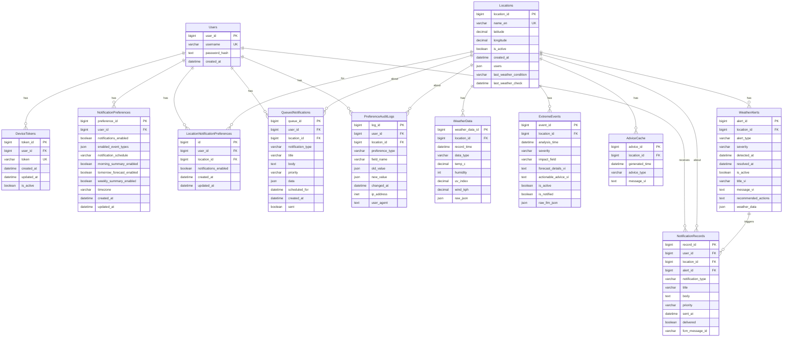

# Database Documentation

## 📋 Mục lục

- [Tổng quan](#tổng-quan)
- [Entity Relationship Diagram (ERD)](#entity-relationship-diagram-erd)
- [Chi tiết các Tables](#chi-tiết-các-tables)
  - [1. Users](#1-users)
  - [2. Locations](#2-locations)
  - [3. DeviceTokens](#3-devicetokens)
  - [4. WeatherData](#4-weatherdata)
  - [5. ExtremeEvents](#5-extremeevents)
  - [6. AdviceCache](#6-advicecache)
  - [7. NotificationPreferences](#7-notificationpreferences)
  - [8. LocationNotificationPreferences](#8-locationnotificationpreferences)
  - [9. WeatherAlerts](#9-weatheralerts)
  - [10. NotificationRecords](#10-notificationrecords)
  - [11. QueuedNotifications](#11-queuednotifications)
  - [12. PreferenceAuditLogs](#12-preferenceauditlogs)
- [Relationships Summary](#relationships-summary)
- [Indexes và Performance](#indexes-và-performance)
- [Data Types và Constraints](#data-types-và-constraints)
- [Database Configuration](#database-configuration)
- [Migration Notes](#migration-notes)
- [Best Practices](#best-practices)

## Tổng quan

Database của hệ thống Weather Forecast được thiết kế để lưu trữ thông tin người dùng, địa điểm, dữ liệu thời tiết, cảnh báo, và quản lý thông báo. Hệ thống sử dụng PostgreSQL làm database chính với Django ORM để quản lý models.

## Entity Relationship Diagram (ERD)

## Chi tiết các Tables

### 1. Users
**Mục đích**: Lưu trữ thông tin người dùng của hệ thống

| Field | Type | Constraints | Description |
|-------|------|-------------|-------------|
| user_id | BigAutoField | PRIMARY KEY | ID tự động tăng của user |
| username | CharField(50) | UNIQUE, NOT NULL | Tên đăng nhập duy nhất |
| password_hash | TextField | NOT NULL | Mật khẩu đã được hash |
| created_at | DateTimeField | DEFAULT timezone.now | Thời gian tạo tài khoản |

**Indexes**: Primary key trên `user_id`, Unique index trên `username`

**Relationships**:
- One-to-Many với `DeviceTokens` (một user có nhiều device tokens)
- One-to-Many với `NotificationPreferences` (một user có nhiều preferences)
- One-to-Many với `LocationNotificationPreferences`
- One-to-Many với `NotificationRecords`
- One-to-Many với `QueuedNotifications`
- One-to-Many với `PreferenceAuditLogs`

---

### 2. Locations
**Mục đích**: Lưu trữ thông tin các địa điểm theo dõi thời tiết

| Field | Type | Constraints | Description |
|-------|------|-------------|-------------|
| location_id | BigAutoField | PRIMARY KEY | ID tự động tăng của location |
| name_en | CharField(100) | UNIQUE, NOT NULL | Tên địa điểm bằng tiếng Anh |
| latitude | DecimalField(10,6) | NOT NULL | Vĩ độ |
| longitude | DecimalField(10,6) | NOT NULL | Kinh độ |
| is_active | BooleanField | DEFAULT True | Trạng thái hoạt động |
| created_at | DateTimeField | DEFAULT timezone.now | Thời gian tạo |
| users | JSONField | DEFAULT list, NULL | Danh sách user IDs theo dõi location này |
| last_weather_condition | CharField(100) | NULL | Điều kiện thời tiết lần cuối kiểm tra |
| last_weather_check | DateTimeField | NULL | Thời gian kiểm tra thời tiết lần cuối |

**Indexes**: Primary key trên `location_id`, Unique index trên `name_en`

**Relationships**:
- One-to-Many với `WeatherData`
- One-to-Many với `ExtremeEvents`
- One-to-Many với `AdviceCache`
- One-to-Many với `LocationNotificationPreferences`
- One-to-Many với `WeatherAlerts`
- One-to-Many với `NotificationRecords`
- One-to-Many với `QueuedNotifications`
- One-to-Many với `PreferenceAuditLogs`

---

### 3. DeviceTokens
**Mục đích**: Lưu trữ FCM device tokens để gửi push notifications

| Field | Type | Constraints | Description |
|-------|------|-------------|-------------|
| token_id | BigAutoField | PRIMARY KEY | ID tự động tăng |
| user_id | ForeignKey | NOT NULL, CASCADE | Tham chiếu đến Users |
| token | CharField(255) | UNIQUE, NOT NULL | FCM device token |
| created_at | DateTimeField | DEFAULT timezone.now | Thời gian tạo token |
| updated_at | DateTimeField | AUTO NOW | Thời gian cập nhật token |
| is_active | BooleanField | DEFAULT True | Trạng thái hoạt động của token |

**Indexes**: 
- Primary key trên `token_id`
- Unique index trên `token`
- Composite index trên `(user_id, is_active)`

**Relationships**:
- Many-to-One với `Users` (nhiều tokens thuộc về một user)

---

### 4. WeatherData
**Mục đích**: Lưu trữ dữ liệu thời tiết lịch sử và dự báo

| Field | Type | Constraints | Description |
|-------|------|-------------|-------------|
| weather_data_id | BigAutoField | PRIMARY KEY | ID tự động tăng |
| location_id | ForeignKey | NOT NULL, CASCADE | Tham chiếu đến Locations |
| record_time | DateTimeField | NOT NULL | Thời gian ghi nhận dữ liệu |
| data_type | CharField(20) | NOT NULL | Loại dữ liệu: 'HISTORY' hoặc 'FORECAST' |
| temp_c | DecimalField(4,2) | NULL | Nhiệt độ (°C) |
| humidity | IntegerField | NULL | Độ ẩm (%) |
| uv_index | DecimalField(3,1) | NULL | Chỉ số UV |
| wind_kph | DecimalField(5,2) | NULL | Tốc độ gió (km/h) |
| raw_json | JSONField | NULL | Dữ liệu JSON gốc từ API |

**Indexes**: 
- Primary key trên `weather_data_id`
- Index trên `record_time`

**Constraints**:
- Unique together trên `(location_id, record_time)` - đảm bảo không có dữ liệu trùng lặp cho cùng location và thời gian

**Relationships**:
- Many-to-One với `Locations`

---

### 5. ExtremeEvents
**Mục đích**: Lưu trữ các sự kiện thời tiết cực đoan được phát hiện

| Field | Type | Constraints | Description |
|-------|------|-------------|-------------|
| event_id | BigAutoField | PRIMARY KEY | ID tự động tăng |
| location_id | ForeignKey | NOT NULL, CASCADE | Tham chiếu đến Locations |
| analysis_time | DateTimeField | DEFAULT timezone.now | Thời gian phân tích |
| severity | CharField(20) | NOT NULL | Mức độ nghiêm trọng |
| impact_field | CharField(50) | NOT NULL | Lĩnh vực bị ảnh hưởng |
| forecast_details_vi | TextField | NOT NULL | Chi tiết dự báo (tiếng Việt) |
| actionable_advice_vi | TextField | NULL | Lời khuyên hành động (tiếng Việt) |
| is_active | BooleanField | DEFAULT True | Trạng thái hoạt động |
| is_notified | BooleanField | DEFAULT False | Đã gửi thông báo chưa |
| raw_llm_json | JSONField | NULL | Dữ liệu JSON gốc từ LLM |

**Indexes**: 
- Primary key trên `event_id`
- Index trên `location_id`

**Relationships**:
- Many-to-One với `Locations`

---

### 6. AdviceCache
**Mục đích**: Cache lời khuyên thời tiết để tránh gọi LLM quá nhiều

| Field | Type | Constraints | Description |
|-------|------|-------------|-------------|
| advice_id | BigAutoField | PRIMARY KEY | ID tự động tăng |
| location_id | ForeignKey | NOT NULL, CASCADE | Tham chiếu đến Locations |
| generated_time | DateTimeField | DEFAULT timezone.now | Thời gian tạo lời khuyên |
| advice_type | CharField(10) | NOT NULL | Loại: 'advice' hoặc 'warning' |
| message_vi | TextField | NOT NULL | Nội dung lời khuyên (tiếng Việt) |

**Indexes**: 
- Primary key trên `advice_id`
- Composite index trên `(location_id, -generated_time)` - để lấy bản ghi mới nhất nhanh

**Ordering**: Mặc định sắp xếp theo `-generated_time` (mới nhất trước)

**Relationships**:
- Many-to-One với `Locations`

---

### 7. NotificationPreferences
**Mục đích**: Lưu trữ preferences thông báo toàn cục của user

| Field | Type | Constraints | Description |
|-------|------|-------------|-------------|
| preference_id | BigAutoField | PRIMARY KEY | ID tự động tăng |
| user_id | ForeignKey | NOT NULL, CASCADE | Tham chiếu đến Users |
| notifications_enabled | BooleanField | DEFAULT True | Bật/tắt thông báo toàn cục |
| enabled_event_types | JSONField | DEFAULT list | Danh sách loại sự kiện được bật |
| notification_schedule | CharField(20) | DEFAULT '24_7' | Lịch thông báo: '24_7' hoặc 'daytime_only' |
| morning_summary_enabled | BooleanField | DEFAULT True | Bật tóm tắt buổi sáng |
| tomorrow_forecast_enabled | BooleanField | DEFAULT True | Bật dự báo ngày mai |
| weekly_summary_enabled | BooleanField | DEFAULT False | Bật tóm tắt tuần |
| timezone | CharField(50) | DEFAULT 'Asia/Ho_Chi_Minh' | Múi giờ của user |
| created_at | DateTimeField | AUTO NOW ADD | Thời gian tạo |
| updated_at | DateTimeField | AUTO NOW | Thời gian cập nhật |

**Indexes**: Primary key trên `preference_id`

**Relationships**:
- Many-to-One với `Users`

---

### 8. LocationNotificationPreferences
**Mục đích**: Lưu trữ preferences thông báo cho từng location cụ thể

| Field | Type | Constraints | Description |
|-------|------|-------------|-------------|
| id | BigAutoField | PRIMARY KEY | ID tự động tăng |
| user_id | ForeignKey | NOT NULL, CASCADE | Tham chiếu đến Users |
| location_id | ForeignKey | NOT NULL, CASCADE | Tham chiếu đến Locations |
| notifications_enabled | BooleanField | DEFAULT True | Bật/tắt thông báo cho location này |
| created_at | DateTimeField | AUTO NOW ADD | Thời gian tạo |
| updated_at | DateTimeField | AUTO NOW | Thời gian cập nhật |

**Indexes**: Primary key trên `id`

**Constraints**:
- Unique together trên `(user_id, location_id)` - mỗi user chỉ có một preference cho mỗi location

**Relationships**:
- Many-to-One với `Users`
- Many-to-One với `Locations`

---

### 9. WeatherAlerts
**Mục đích**: Lưu trữ các cảnh báo thời tiết được phát hiện bởi hệ thống monitoring

| Field | Type | Constraints | Description |
|-------|------|-------------|-------------|
| alert_id | BigAutoField | PRIMARY KEY | ID tự động tăng |
| location_id | ForeignKey | NOT NULL, CASCADE | Tham chiếu đến Locations |
| alert_type | CharField(50) | NOT NULL | Loại cảnh báo: 'heavy_rain', 'storm', 'extreme_heat', 'extreme_cold' |
| severity | CharField(20) | NOT NULL | Mức độ: 'high', 'medium', 'low' |
| detected_at | DateTimeField | AUTO NOW ADD | Thời gian phát hiện |
| resolved_at | DateTimeField | NULL | Thời gian giải quyết |
| is_active | BooleanField | DEFAULT True | Trạng thái hoạt động |
| title_vi | CharField(200) | NOT NULL | Tiêu đề cảnh báo (tiếng Việt) |
| message_vi | TextField | NOT NULL | Nội dung cảnh báo (tiếng Việt) |
| recommended_actions | TextField | NULL | Hành động được khuyến nghị |
| weather_data | JSONField | NOT NULL | Dữ liệu thời tiết tại thời điểm cảnh báo |

**Indexes**: 
- Primary key trên `alert_id`
- Composite index trên `(location_id, -detected_at)`
- Index trên `is_active`

**Relationships**:
- Many-to-One với `Locations`
- One-to-Many với `NotificationRecords`

---

### 10. NotificationRecords
**Mục đích**: Lịch sử các thông báo đã gửi đến users

| Field | Type | Constraints | Description |
|-------|------|-------------|-------------|
| record_id | BigAutoField | PRIMARY KEY | ID tự động tăng |
| user_id | ForeignKey | NOT NULL, CASCADE | Tham chiếu đến Users |
| location_id | ForeignKey | NULL, SET_NULL | Tham chiếu đến Locations |
| notification_type | CharField(50) | NOT NULL | Loại: 'alert', 'morning_summary', 'tomorrow_forecast', 'weekly_summary' |
| alert_id | ForeignKey | NULL, SET_NULL | Tham chiếu đến WeatherAlerts |
| title | CharField(200) | NOT NULL | Tiêu đề thông báo |
| body | TextField | NOT NULL | Nội dung thông báo |
| priority | CharField(20) | NOT NULL | Độ ưu tiên: 'high', 'medium', 'low' |
| sent_at | DateTimeField | AUTO NOW ADD | Thời gian gửi |
| delivered | BooleanField | DEFAULT False | Đã gửi thành công chưa |
| fcm_message_id | CharField(255) | NULL | Message ID từ FCM |

**Indexes**: 
- Primary key trên `record_id`
- Composite index trên `(user_id, -sent_at)`
- Index trên `notification_type`

**Relationships**:
- Many-to-One với `Users`
- Many-to-One với `Locations` (SET_NULL khi location bị xóa)
- Many-to-One với `WeatherAlerts` (SET_NULL khi alert bị xóa)

---

### 11. QueuedNotifications
**Mục đích**: Thông báo được xếp hàng để gửi sau (scheduled notifications)

| Field | Type | Constraints | Description |
|-------|------|-------------|-------------|
| queue_id | BigAutoField | PRIMARY KEY | ID tự động tăng |
| user_id | ForeignKey | NOT NULL, CASCADE | Tham chiếu đến Users |
| location_id | ForeignKey | NULL, CASCADE | Tham chiếu đến Locations |
| notification_type | CharField(50) | NOT NULL | Loại thông báo |
| title | CharField(200) | NOT NULL | Tiêu đề |
| body | TextField | NOT NULL | Nội dung |
| priority | CharField(20) | NOT NULL | Độ ưu tiên |
| data | JSONField | DEFAULT dict | Dữ liệu bổ sung |
| scheduled_for | DateTimeField | NOT NULL | Thời gian dự kiến gửi |
| created_at | DateTimeField | AUTO NOW ADD | Thời gian tạo |
| sent | BooleanField | DEFAULT False | Đã gửi chưa |

**Indexes**: 
- Primary key trên `queue_id`
- Composite index trên `(scheduled_for, sent)` - để query các notification cần gửi

**Relationships**:
- Many-to-One với `Users`
- Many-to-One với `Locations`

---

### 12. PreferenceAuditLogs
**Mục đích**: Audit log cho các thay đổi notification preferences

| Field | Type | Constraints | Description |
|-------|------|-------------|-------------|
| log_id | BigAutoField | PRIMARY KEY | ID tự động tăng |
| user_id | ForeignKey | NOT NULL, CASCADE | Tham chiếu đến Users |
| preference_type | CharField(50) | NOT NULL | Loại preference: 'global' hoặc 'location' |
| location_id | ForeignKey | NULL, SET_NULL | Tham chiếu đến Locations (nếu là location preference) |
| field_name | CharField(100) | NOT NULL | Tên field được thay đổi |
| old_value | JSONField | NULL | Giá trị cũ |
| new_value | JSONField | NULL | Giá trị mới |
| changed_at | DateTimeField | AUTO NOW ADD | Thời gian thay đổi |
| ip_address | GenericIPAddressField | NULL | Địa chỉ IP của request |
| user_agent | TextField | NULL | User agent của request |

**Indexes**: 
- Primary key trên `log_id`
- Composite index trên `(user_id, -changed_at)`
- Index trên `preference_type`

**Ordering**: Mặc định sắp xếp theo `-changed_at` (mới nhất trước)

**Relationships**:
- Many-to-One với `Users`
- Many-to-One với `Locations` (SET_NULL khi location bị xóa)

---

## Relationships Summary

### Foreign Key Relationships

1. **Users → DeviceTokens**: One-to-Many (CASCADE)
2. **Users → NotificationPreferences**: One-to-Many (CASCADE)
3. **Users → LocationNotificationPreferences**: One-to-Many (CASCADE)
4. **Users → NotificationRecords**: One-to-Many (CASCADE)
5. **Users → QueuedNotifications**: One-to-Many (CASCADE)
6. **Users → PreferenceAuditLogs**: One-to-Many (CASCADE)

7. **Locations → WeatherData**: One-to-Many (CASCADE)
8. **Locations → ExtremeEvents**: One-to-Many (CASCADE)
9. **Locations → AdviceCache**: One-to-Many (CASCADE)
10. **Locations → LocationNotificationPreferences**: One-to-Many (CASCADE)
11. **Locations → WeatherAlerts**: One-to-Many (CASCADE)
12. **Locations → NotificationRecords**: One-to-Many (SET_NULL)
13. **Locations → QueuedNotifications**: One-to-Many (CASCADE)
14. **Locations → PreferenceAuditLogs**: One-to-Many (SET_NULL)

15. **WeatherAlerts → NotificationRecords**: One-to-Many (SET_NULL)

### Cascade Behaviors

- **CASCADE**: Khi parent record bị xóa, tất cả child records cũng bị xóa
  - Áp dụng cho: DeviceTokens, NotificationPreferences, LocationNotificationPreferences, QueuedNotifications, PreferenceAuditLogs, WeatherData, ExtremeEvents, AdviceCache, WeatherAlerts
  
- **SET_NULL**: Khi parent record bị xóa, foreign key của child records được set thành NULL
  - Áp dụng cho: NotificationRecords (location_id, alert_id), PreferenceAuditLogs (location_id)

## Indexes và Performance

### Composite Indexes
1. `DeviceTokens`: `(user_id, is_active)` - Tìm active tokens của user
2. `AdviceCache`: `(location_id, -generated_time)` - Lấy advice mới nhất cho location
3. `WeatherAlerts`: `(location_id, -detected_at)` - Lấy alerts mới nhất cho location
4. `NotificationRecords`: `(user_id, -sent_at)` - Lấy notification history của user
5. `QueuedNotifications`: `(scheduled_for, sent)` - Query notifications cần gửi
6. `PreferenceAuditLogs`: `(user_id, -changed_at)` - Lấy audit logs của user

### Single Column Indexes
1. `WeatherData`: `record_time` - Query theo thời gian
2. `ExtremeEvents`: `location_id` - Query events theo location
3. `WeatherAlerts`: `is_active` - Filter active alerts
4. `NotificationRecords`: `notification_type` - Filter theo loại notification
5. `PreferenceAuditLogs`: `preference_type` - Filter theo loại preference

### Unique Constraints
1. `Users`: `username` - Đảm bảo username duy nhất
2. `Locations`: `name_en` - Đảm bảo tên location duy nhất
3. `DeviceTokens`: `token` - Đảm bảo FCM token duy nhất
4. `WeatherData`: `(location_id, record_time)` - Không có dữ liệu trùng lặp
5. `LocationNotificationPreferences`: `(user_id, location_id)` - Mỗi user chỉ có một preference cho mỗi location

## Data Types và Constraints

### Numeric Types
- **BigAutoField**: Primary keys (64-bit integer, auto-increment)
- **DecimalField**: Dữ liệu số chính xác (latitude, longitude, temperature, wind speed, UV index)
- **IntegerField**: Số nguyên (humidity)

### String Types
- **CharField**: Chuỗi có độ dài giới hạn (username, token, alert_type, severity, etc.)
- **TextField**: Chuỗi không giới hạn độ dài (password_hash, messages, advice, etc.)

### Date/Time Types
- **DateTimeField**: Lưu trữ ngày giờ với timezone awareness
  - `auto_now_add=True`: Tự động set khi tạo record
  - `auto_now=True`: Tự động update khi save record
  - `default=timezone.now`: Set giá trị mặc định là thời gian hiện tại

### Boolean Types
- **BooleanField**: True/False values với default values

### JSON Types
- **JSONField**: Lưu trữ dữ liệu JSON (users list, raw API data, preferences, etc.)

### Network Types
- **GenericIPAddressField**: Lưu trữ IPv4 hoặc IPv6 addresses

## Database Configuration

Database được cấu hình trong `settings.py`:
- **Engine**: PostgreSQL (django.db.backends.postgresql)
- **Timezone Support**: Enabled (USE_TZ = True)
- **Default Timezone**: Asia/Ho_Chi_Minh

## Migration Notes

- Tất cả models sử dụng `timezone.now` thay vì `auto_now_add=True` cho `created_at` để tương thích tốt hơn với tests
- Một số tables sử dụng dấu ngoặc kép trong `db_table` để tương thích với PostgreSQL case-sensitive naming
- JSONField được import từ `django.db.models` (Django 3.1+) với fallback cho phiên bản cũ hơn

## Best Practices

1. **Indexing**: Tất cả foreign keys đều được index tự động. Composite indexes được tạo cho các query patterns phổ biến.
2. **Cascade Behaviors**: Sử dụng CASCADE cho data integrity, SET_NULL cho historical records.
3. **Unique Constraints**: Đảm bảo data integrity ở database level.
4. **Default Values**: Sử dụng default values hợp lý để tránh NULL values không cần thiết.
5. **Ordering**: Định nghĩa default ordering cho các models có time-based queries.
