# Backend Flows Documentation

## Mục lục
1. [Authentication Flow](#1-authentication-flow)
2. [Weather Data Flow](#2-weather-data-flow)
3. [Notification Flow](#3-notification-flow)
4. [Location Tracking Flow](#4-location-tracking-flow)
5. [Scheduled Notification Flow](#5-scheduled-notification-flow)

---

## 1. Authentication Flow

### 1.1 User Registration Flow

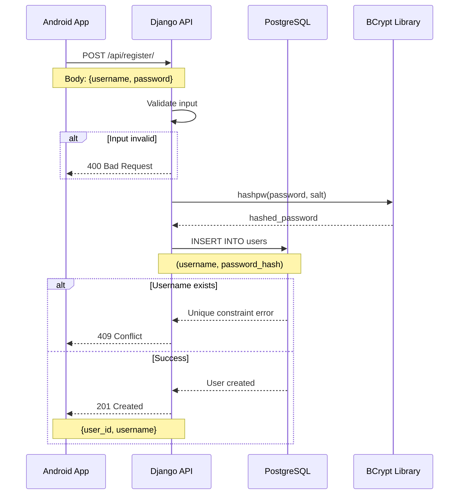
```mermaid
sequenceDiagram
    participant Client as Android App
    participant API as Django API
    participant DB as PostgreSQL
    participant BCrypt as BCrypt Library

    Client->>API: POST /api/register/
    Note over Client,API: Body: {username, password}
    
    API->>API: Validate input
    alt Input invalid
        API-->>Client: 400 Bad Request
    end
    
    API->>BCrypt: hashpw(password, salt)
    BCrypt-->>API: hashed_password
    
    API->>DB: INSERT INTO users
    Note over API,DB: (username, password_hash)
    
    alt Username exists
        DB-->>API: Unique constraint error
        API-->>Client: 409 Conflict
    else Success
        DB-->>API: User created
        API-->>Client: 201 Created
        Note over Client,API: {user_id, username}
    end
```

### 1.2 User Login Flow

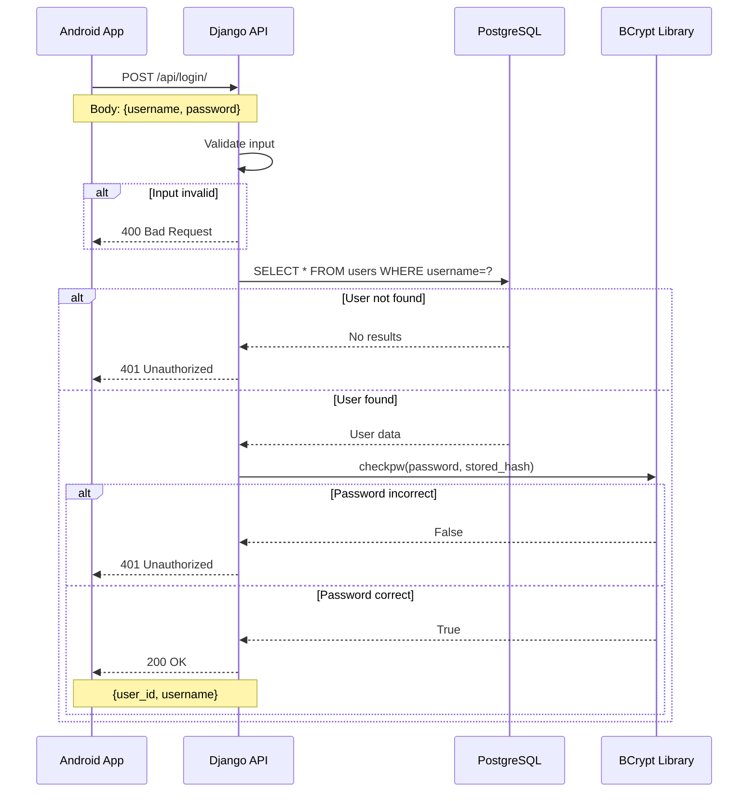
```mermaid
sequenceDiagram
    participant Client as Android App
    participant API as Django API
    participant DB as PostgreSQL
    participant BCrypt as BCrypt Library

    Client->>API: POST /api/login/
    Note over Client,API: Body: {username, password}
    
    API->>API: Validate input
    alt Input invalid
        API-->>Client: 400 Bad Request
    end
    
    API->>DB: SELECT * FROM users WHERE username=?
    
    alt User not found
        DB-->>API: No results
        API-->>Client: 401 Unauthorized
    else User found
        DB-->>API: User data
        API->>BCrypt: checkpw(password, stored_hash)
        
        alt Password incorrect
            BCrypt-->>API: False
            API-->>Client: 401 Unauthorized
        else Password correct
            BCrypt-->>API: True
            API-->>Client: 200 OK
            Note over Client,API: {user_id, username}
        end
    end
```

---

## 2. Weather Data Flow

### 2.1 Current Weather Query Flow

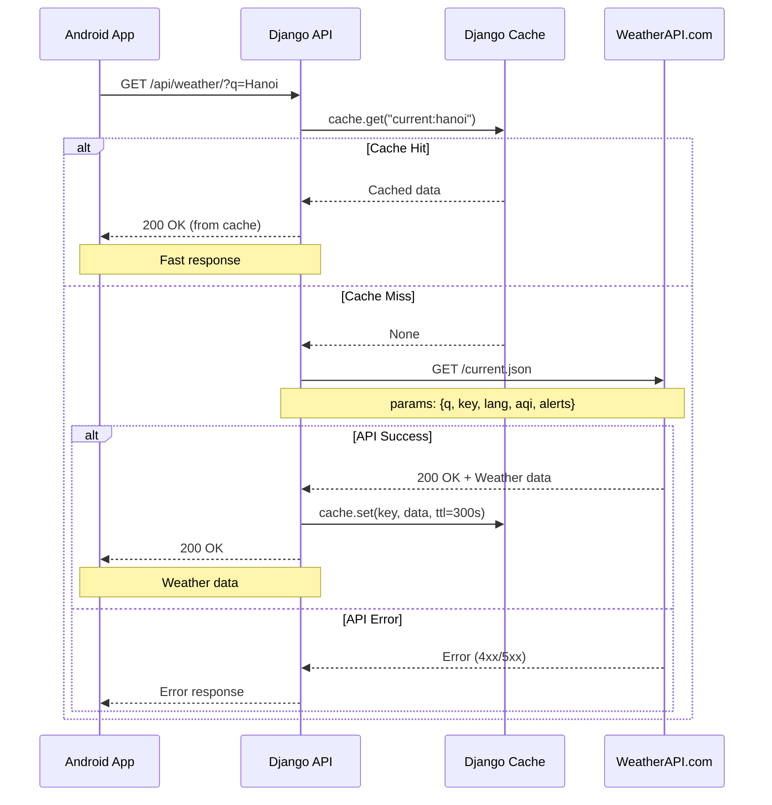
```mermaid
sequenceDiagram
    participant Client as Android App
    participant API as Django API
    participant Cache as Django Cache
    participant WeatherAPI as WeatherAPI.com

    Client->>API: GET /api/weather/?q=Hanoi
    
    API->>Cache: cache.get("current:hanoi")
    
    alt Cache Hit
        Cache-->>API: Cached data
        API-->>Client: 200 OK (from cache)
        Note over Client,API: Fast response
    else Cache Miss
        Cache-->>API: None
        
        API->>WeatherAPI: GET /current.json
        Note over API,WeatherAPI: params: {q, key, lang, aqi, alerts}
        
        alt API Success
            WeatherAPI-->>API: 200 OK + Weather data
            API->>Cache: cache.set(key, data, ttl=300s)
            API-->>Client: 200 OK
            Note over Client,API: Weather data
        else API Error
            WeatherAPI-->>API: Error (4xx/5xx)
            API-->>Client: Error response
        end
    end
```

### 2.2 Forecast Weather Query Flow

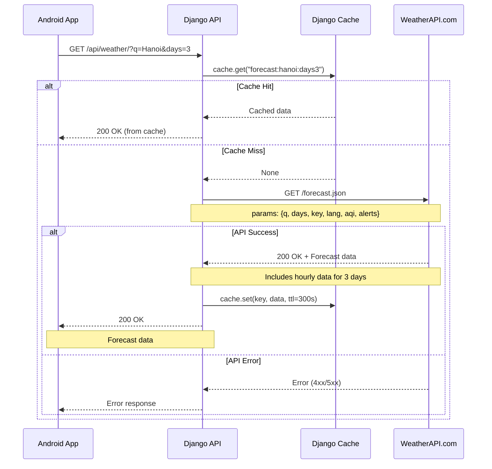
```mermaid
sequenceDiagram
    participant Client as Android App
    participant API as Django API
    participant Cache as Django Cache
    participant WeatherAPI as WeatherAPI.com

    Client->>API: GET /api/weather/?q=Hanoi&days=3
    
    API->>Cache: cache.get("forecast:hanoi:days3")
    
    alt Cache Hit
        Cache-->>API: Cached data
        API-->>Client: 200 OK (from cache)
    else Cache Miss
        Cache-->>API: None
        
        API->>WeatherAPI: GET /forecast.json
        Note over API,WeatherAPI: params: {q, days, key, lang, aqi, alerts}
        
        alt API Success
            WeatherAPI-->>API: 200 OK + Forecast data
            Note over WeatherAPI,API: Includes hourly data for 3 days
            API->>Cache: cache.set(key, data, ttl=300s)
            API-->>Client: 200 OK
            Note over Client,API: Forecast data
        else API Error
            WeatherAPI-->>API: Error (4xx/5xx)
            API-->>Client: Error response
        end
    end
```

### 2.3 AI Advice Generation Flow

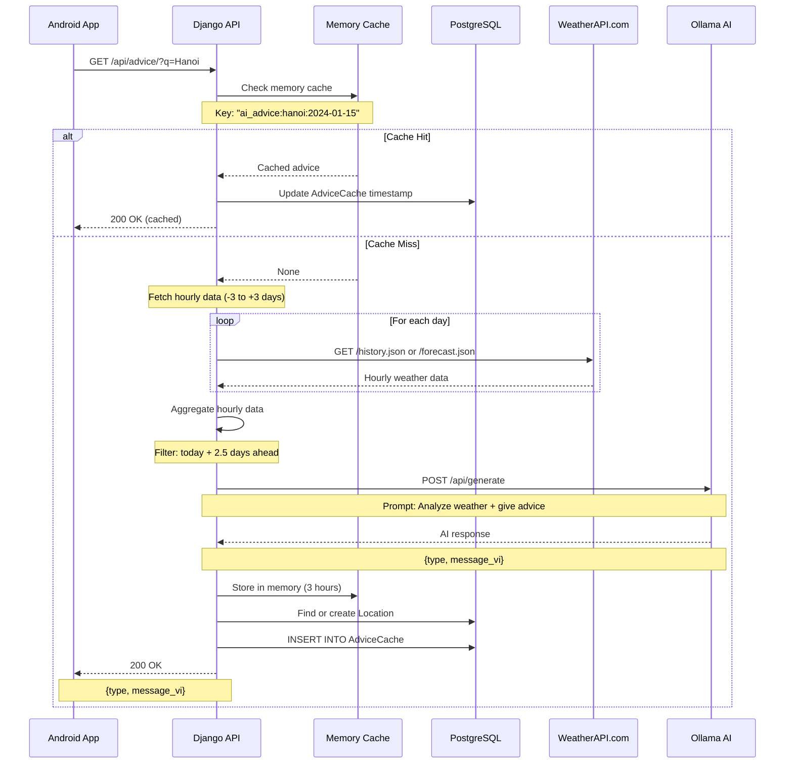
```mermaid
sequenceDiagram
    participant Client as Android App
    participant API as Django API
    participant Cache as Memory Cache
    participant DB as PostgreSQL
    participant WeatherAPI as WeatherAPI.com
    participant Ollama as Ollama AI

    Client->>API: GET /api/advice/?q=Hanoi
    
    API->>Cache: Check memory cache
    Note over API,Cache: Key: "ai_advice:hanoi:2024-01-15"
    
    alt Cache Hit
        Cache-->>API: Cached advice
        API->>DB: Update AdviceCache timestamp
        API-->>Client: 200 OK (cached)
    else Cache Miss
        Cache-->>API: None
        
        Note over API: Fetch hourly data (-3 to +3 days)
        
        loop For each day
            API->>WeatherAPI: GET /history.json or /forecast.json
            WeatherAPI-->>API: Hourly weather data
        end
        
        API->>API: Aggregate hourly data
        Note over API: Filter: today + 2.5 days ahead
        
        API->>Ollama: POST /api/generate
        Note over API,Ollama: Prompt: Analyze weather + give advice
        
        Ollama-->>API: AI response
        Note over Ollama,API: {type, message_vi}
        
        API->>Cache: Store in memory (3 hours)
        
        API->>DB: Find or create Location
        API->>DB: INSERT INTO AdviceCache
        
        API-->>Client: 200 OK
        Note over Client,API: {type, message_vi}
    end
```

---

## 3. Notification Flow

### 3.1 Weather Alert Detection & Notification Flow

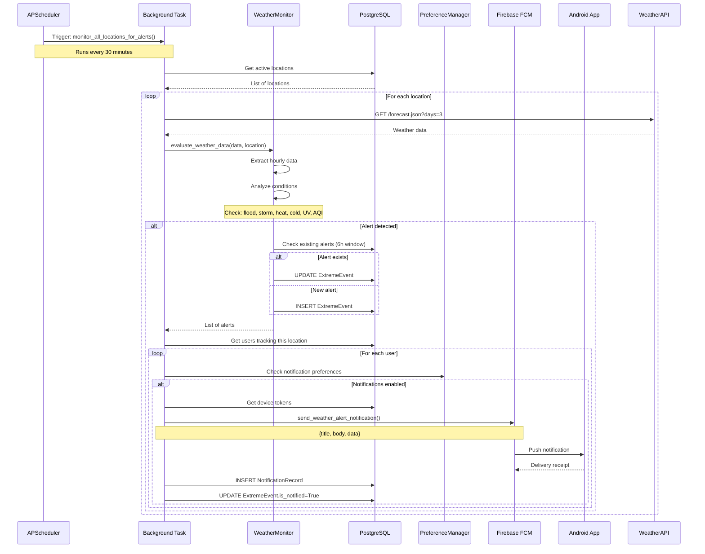
```mermaid
sequenceDiagram
    participant Scheduler as APScheduler
    participant Task as Background Task
    participant Monitor as WeatherMonitor
    participant DB as PostgreSQL
    participant PrefMgr as PreferenceManager
    participant FCM as Firebase FCM
    participant Client as Android App

    Scheduler->>Task: Trigger: monitor_all_locations_for_alerts()
    Note over Scheduler,Task: Runs every 30 minutes
    
    Task->>DB: Get active locations
    DB-->>Task: List of locations
    
    loop For each location
        Task->>WeatherAPI: GET /forecast.json?days=3
        WeatherAPI-->>Task: Weather data
        
        Task->>Monitor: evaluate_weather_data(data, location)
        
        Monitor->>Monitor: Extract hourly data
        Monitor->>Monitor: Analyze conditions
        Note over Monitor: Check: flood, storm, heat, cold, UV, AQI
        
        alt Alert detected
            Monitor->>DB: Check existing alerts (6h window)
            
            alt Alert exists
                Monitor->>DB: UPDATE ExtremeEvent
            else New alert
                Monitor->>DB: INSERT ExtremeEvent
            end
            
            Monitor-->>Task: List of alerts
            
            Task->>DB: Get users tracking this location
            
            loop For each user
                Task->>PrefMgr: Check notification preferences
                
                alt Notifications enabled
                    Task->>DB: Get device tokens
                    Task->>FCM: send_weather_alert_notification()
                    Note over Task,FCM: {title, body, data}
                    
                    FCM->>Client: Push notification
                    Client-->>FCM: Delivery receipt
                    
                    Task->>DB: INSERT NotificationRecord
                    Task->>DB: UPDATE ExtremeEvent.is_notified=True
                end
            end
        end
    end
```

### 3.2 Device Token Registration Flow

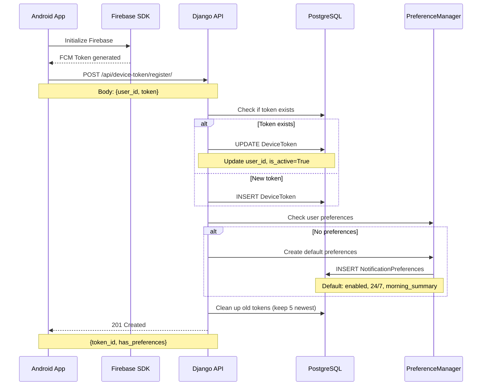
```mermaid
sequenceDiagram
    participant Client as Android App
    participant Firebase as Firebase SDK
    participant API as Django API
    participant DB as PostgreSQL
    participant PrefMgr as PreferenceManager

    Client->>Firebase: Initialize Firebase
    Firebase-->>Client: FCM Token generated
    
    Client->>API: POST /api/device-token/register/
    Note over Client,API: Body: {user_id, token}
    
    API->>DB: Check if token exists
    
    alt Token exists
        API->>DB: UPDATE DeviceToken
        Note over API,DB: Update user_id, is_active=True
    else New token
        API->>DB: INSERT DeviceToken
    end
    
    API->>PrefMgr: Check user preferences
    
    alt No preferences
        API->>PrefMgr: Create default preferences
        PrefMgr->>DB: INSERT NotificationPreferences
        Note over PrefMgr,DB: Default: enabled, 24/7, morning_summary
    end
    
    API->>DB: Clean up old tokens (keep 5 newest)
    
    API-->>Client: 201 Created
    Note over Client,API: {token_id, has_preferences}
```

### 3.3 Notification Preference Update Flow

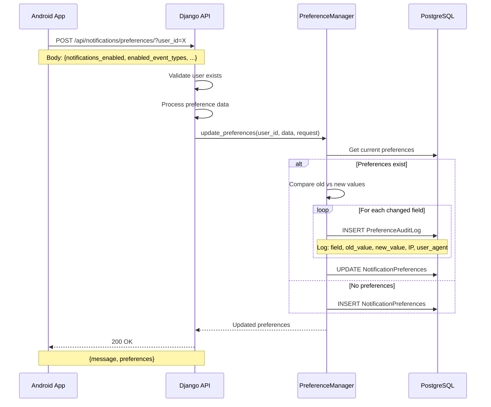
```mermaid
sequenceDiagram
    participant Client as Android App
    participant API as Django API
    participant PrefMgr as PreferenceManager
    participant DB as PostgreSQL

    Client->>API: POST /api/notifications/preferences/?user_id=X
    Note over Client,API: Body: {notifications_enabled, enabled_event_types, ...}
    
    API->>API: Validate user exists
    API->>API: Process preference data
    
    API->>PrefMgr: update_preferences(user_id, data, request)
    
    PrefMgr->>DB: Get current preferences
    
    alt Preferences exist
        PrefMgr->>PrefMgr: Compare old vs new values
        
        loop For each changed field
            PrefMgr->>DB: INSERT PreferenceAuditLog
            Note over PrefMgr,DB: Log: field, old_value, new_value, IP, user_agent
        end
        
        PrefMgr->>DB: UPDATE NotificationPreferences
    else No preferences
        PrefMgr->>DB: INSERT NotificationPreferences
    end
    
    PrefMgr-->>API: Updated preferences
    API-->>Client: 200 OK
    Note over Client,API: {message, preferences}
```

---

## 4. Location Tracking Flow

### 4.1 Track New Location Flow

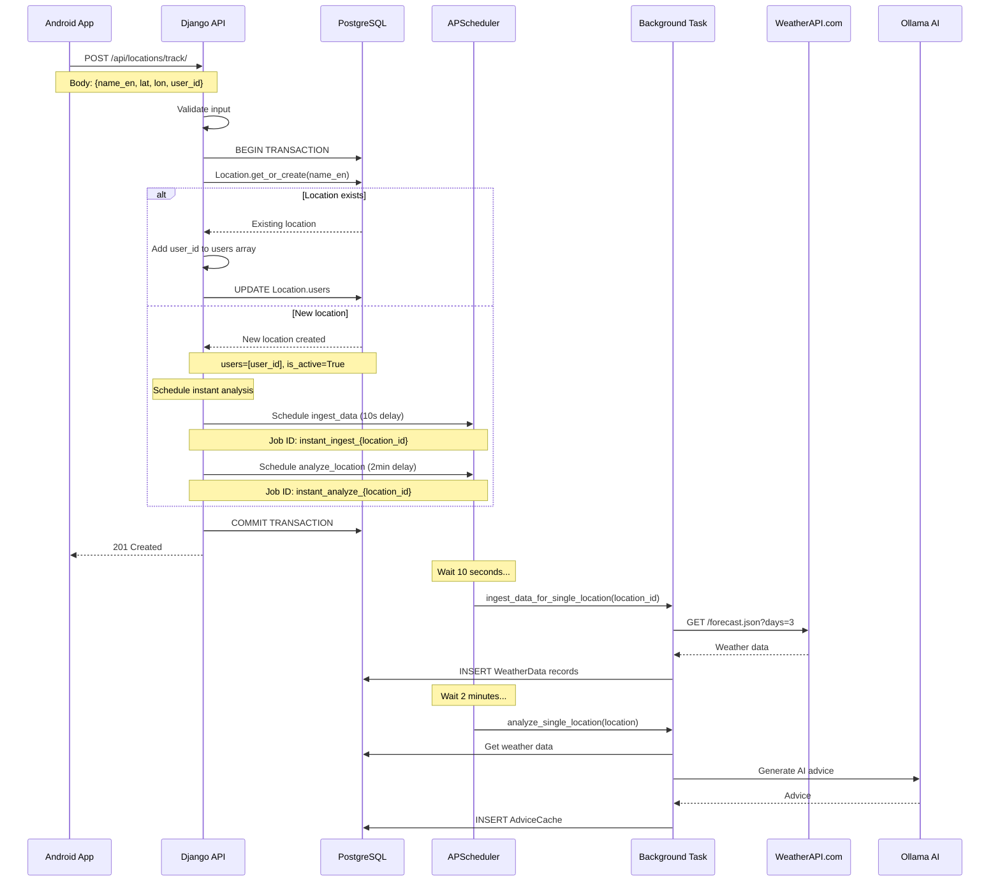
```mermaid
sequenceDiagram
    participant Client as Android App
    participant API as Django API
    participant DB as PostgreSQL
    participant Scheduler as APScheduler
    participant Task as Background Task
    participant WeatherAPI as WeatherAPI.com
    participant Ollama as Ollama AI

    Client->>API: POST /api/locations/track/
    Note over Client,API: Body: {name_en, lat, lon, user_id}
    
    API->>API: Validate input
    
    API->>DB: BEGIN TRANSACTION
    API->>DB: Location.get_or_create(name_en)
    
    alt Location exists
        DB-->>API: Existing location
        API->>API: Add user_id to users array
        API->>DB: UPDATE Location.users
    else New location
        DB-->>API: New location created
        Note over DB,API: users=[user_id], is_active=True
        
        Note over API: Schedule instant analysis
        
        API->>Scheduler: Schedule ingest_data (10s delay)
        Note over API,Scheduler: Job ID: instant_ingest_{location_id}
        
        API->>Scheduler: Schedule analyze_location (2min delay)
        Note over API,Scheduler: Job ID: instant_analyze_{location_id}
    end
    
    API->>DB: COMMIT TRANSACTION
    API-->>Client: 201 Created
    
    Note over Scheduler: Wait 10 seconds...
    
    Scheduler->>Task: ingest_data_for_single_location(location_id)
    Task->>WeatherAPI: GET /forecast.json?days=3
    WeatherAPI-->>Task: Weather data
    Task->>DB: INSERT WeatherData records
    
    Note over Scheduler: Wait 2 minutes...
    
    Scheduler->>Task: analyze_single_location(location)
    Task->>DB: Get weather data
    Task->>Ollama: Generate AI advice
    Ollama-->>Task: Advice
    Task->>DB: INSERT AdviceCache
```

### 4.2 Get Tracked Locations Flow

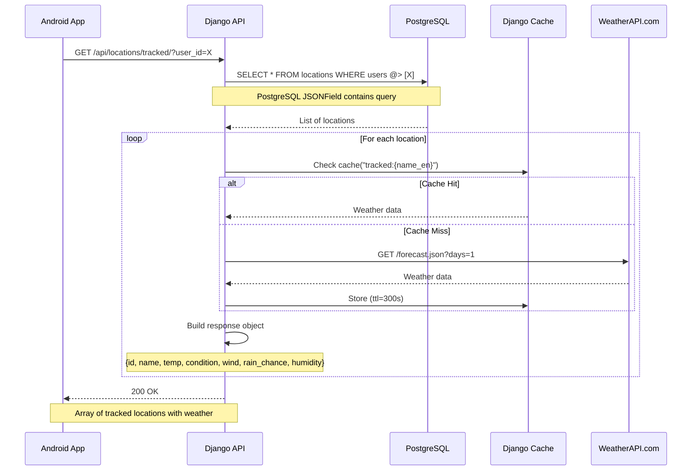
```mermaid
sequenceDiagram
    participant Client as Android App
    participant API as Django API
    participant DB as PostgreSQL
    participant Cache as Django Cache
    participant WeatherAPI as WeatherAPI.com

    Client->>API: GET /api/locations/tracked/?user_id=X
    
    API->>DB: SELECT * FROM locations WHERE users @> [X]
    Note over API,DB: PostgreSQL JSONField contains query
    
    DB-->>API: List of locations
    
    loop For each location
        API->>Cache: Check cache("tracked:{name_en}")
        
        alt Cache Hit
            Cache-->>API: Weather data
        else Cache Miss
            API->>WeatherAPI: GET /forecast.json?days=1
            WeatherAPI-->>API: Weather data
            API->>Cache: Store (ttl=300s)
        end
        
        API->>API: Build response object
        Note over API: {id, name, temp, condition, wind, rain_chance, humidity}
    end
    
    API-->>Client: 200 OK
    Note over Client,API: Array of tracked locations with weather
```

### 4.3 Delete Tracked Location Flow

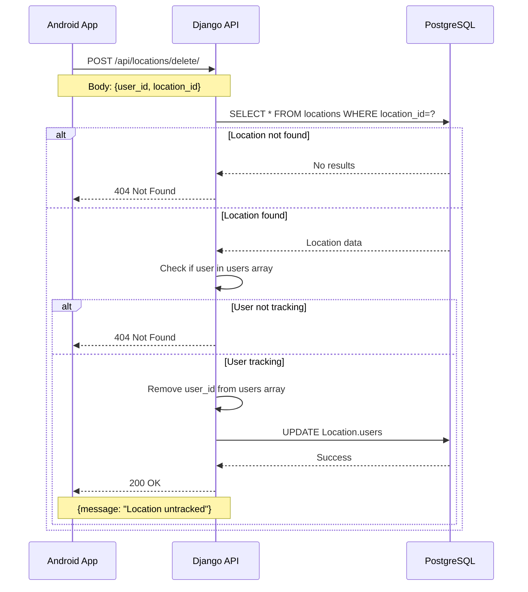
```mermaid
sequenceDiagram
    participant Client as Android App
    participant API as Django API
    participant DB as PostgreSQL

    Client->>API: POST /api/locations/delete/
    Note over Client,API: Body: {user_id, location_id}
    
    API->>DB: SELECT * FROM locations WHERE location_id=?
    
    alt Location not found
        DB-->>API: No results
        API-->>Client: 404 Not Found
    else Location found
        DB-->>API: Location data
        
        API->>API: Check if user in users array
        
        alt User not tracking
            API-->>Client: 404 Not Found
        else User tracking
            API->>API: Remove user_id from users array
            API->>DB: UPDATE Location.users
            DB-->>API: Success
            API-->>Client: 200 OK
            Note over Client,API: {message: "Location untracked"}
        end
    end
```

---

## 5. Scheduled Notification Flow

### 5.1 Morning Summary Flow (7:00 AM)

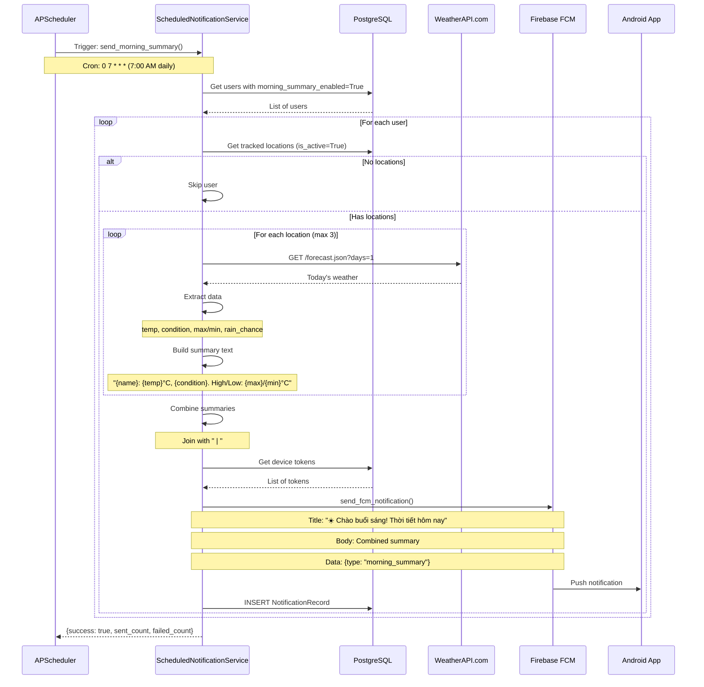
```mermaid
sequenceDiagram
    participant Scheduler as APScheduler
    participant Service as ScheduledNotificationService
    participant DB as PostgreSQL
    participant WeatherAPI as WeatherAPI.com
    participant FCM as Firebase FCM
    participant Client as Android App

    Scheduler->>Service: Trigger: send_morning_summary()
    Note over Scheduler,Service: Cron: 0 7 * * * (7:00 AM daily)
    
    Service->>DB: Get users with morning_summary_enabled=True
    DB-->>Service: List of users
    
    loop For each user
        Service->>DB: Get tracked locations (is_active=True)
        
        alt No locations
            Service->>Service: Skip user
        else Has locations
            loop For each location (max 3)
                Service->>WeatherAPI: GET /forecast.json?days=1
                WeatherAPI-->>Service: Today's weather
                
                Service->>Service: Extract data
                Note over Service: temp, condition, max/min, rain_chance
                
                Service->>Service: Build summary text
                Note over Service: "{name}: {temp}°C, {condition}. High/Low: {max}/{min}°C"
            end
            
            Service->>Service: Combine summaries
            Note over Service: Join with " | "
            
            Service->>DB: Get device tokens
            DB-->>Service: List of tokens
            
            Service->>FCM: send_fcm_notification()
            Note over Service,FCM: Title: "☀️ Chào buổi sáng! Thời tiết hôm nay"
            Note over Service,FCM: Body: Combined summary
            Note over Service,FCM: Data: {type: "morning_summary"}
            
            FCM->>Client: Push notification
            
            Service->>DB: INSERT NotificationRecord
        end
    end
    
    Service-->>Scheduler: {success: true, sent_count, failed_count}
```

### 5.2 Tomorrow Forecast Flow (8:00 PM)

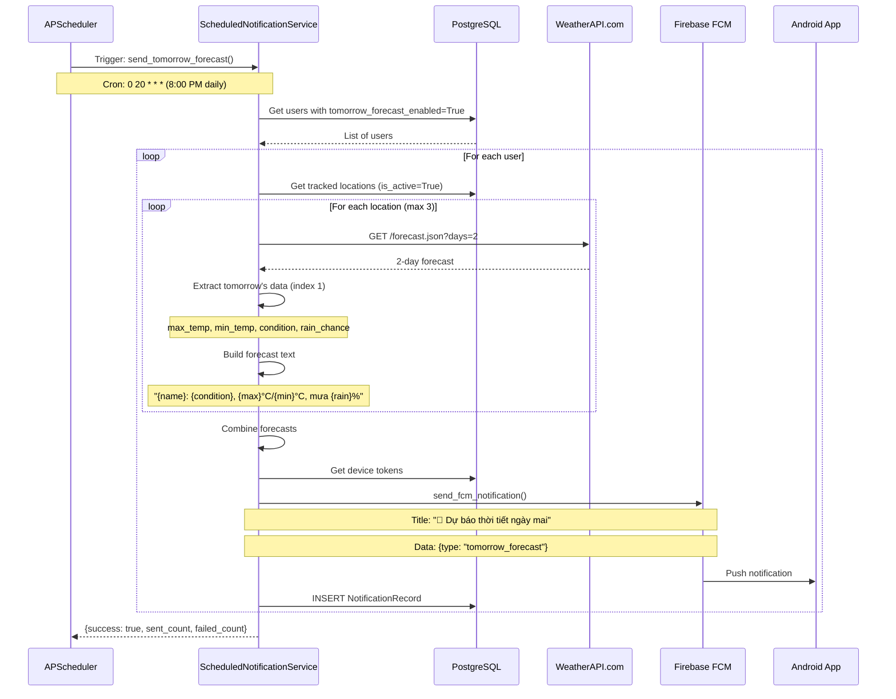
```mermaid
sequenceDiagram
    participant Scheduler as APScheduler
    participant Service as ScheduledNotificationService
    participant DB as PostgreSQL
    participant WeatherAPI as WeatherAPI.com
    participant FCM as Firebase FCM
    participant Client as Android App

    Scheduler->>Service: Trigger: send_tomorrow_forecast()
    Note over Scheduler,Service: Cron: 0 20 * * * (8:00 PM daily)
    
    Service->>DB: Get users with tomorrow_forecast_enabled=True
    DB-->>Service: List of users
    
    loop For each user
        Service->>DB: Get tracked locations (is_active=True)
        
        loop For each location (max 3)
            Service->>WeatherAPI: GET /forecast.json?days=2
            WeatherAPI-->>Service: 2-day forecast
            
            Service->>Service: Extract tomorrow's data (index 1)
            Note over Service: max_temp, min_temp, condition, rain_chance
            
            Service->>Service: Build forecast text
            Note over Service: "{name}: {condition}, {max}°C/{min}°C, mưa {rain}%"
        end
        
        Service->>Service: Combine forecasts
        
        Service->>DB: Get device tokens
        Service->>FCM: send_fcm_notification()
        Note over Service,FCM: Title: "🌙 Dự báo thời tiết ngày mai"
        Note over Service,FCM: Data: {type: "tomorrow_forecast"}
        
        FCM->>Client: Push notification
        Service->>DB: INSERT NotificationRecord
    end
    
    Service-->>Scheduler: {success: true, sent_count, failed_count}
```

### 5.3 Weekly Summary Flow (8:00 PM Sunday)

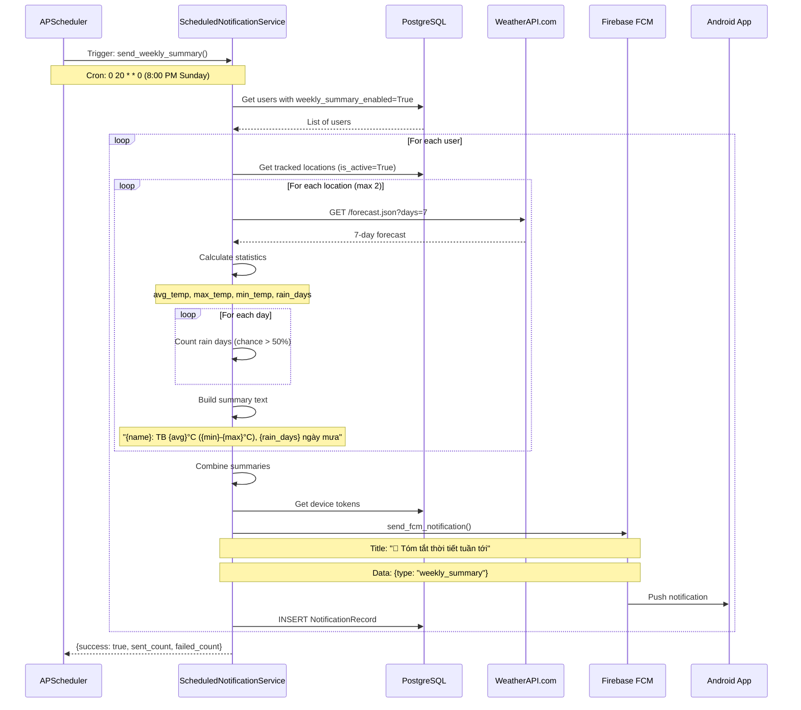
```mermaid
sequenceDiagram
    participant Scheduler as APScheduler
    participant Service as ScheduledNotificationService
    participant DB as PostgreSQL
    participant WeatherAPI as WeatherAPI.com
    participant FCM as Firebase FCM
    participant Client as Android App

    Scheduler->>Service: Trigger: send_weekly_summary()
    Note over Scheduler,Service: Cron: 0 20 * * 0 (8:00 PM Sunday)
    
    Service->>DB: Get users with weekly_summary_enabled=True
    DB-->>Service: List of users
    
    loop For each user
        Service->>DB: Get tracked locations (is_active=True)
        
        loop For each location (max 2)
            Service->>WeatherAPI: GET /forecast.json?days=7
            WeatherAPI-->>Service: 7-day forecast
            
            Service->>Service: Calculate statistics
            Note over Service: avg_temp, max_temp, min_temp, rain_days
            
            loop For each day
                Service->>Service: Count rain days (chance > 50%)
            end
            
            Service->>Service: Build summary text
            Note over Service: "{name}: TB {avg}°C ({min}-{max}°C), {rain_days} ngày mưa"
        end
        
        Service->>Service: Combine summaries
        
        Service->>DB: Get device tokens
        Service->>FCM: send_fcm_notification()
        Note over Service,FCM: Title: "📅 Tóm tắt thời tiết tuần tới"
        Note over Service,FCM: Data: {type: "weekly_summary"}
        
        FCM->>Client: Push notification
        Service->>DB: INSERT NotificationRecord
    end
    
    Service-->>Scheduler: {success: true, sent_count, failed_count}
```

---

## Tổng kết

### Các Flow chính:
1. **Authentication Flow**: Đăng ký và đăng nhập user với bcrypt hashing
2. **Weather Data Flow**: Query thời tiết với caching và fallback
3. **Notification Flow**: Phát hiện cảnh báo và gửi push notification
4. **Location Tracking Flow**: Theo dõi địa điểm với instant AI analysis
5. **Scheduled Notification Flow**: Gửi thông báo định kỳ (sáng, tối, tuần)

### Công nghệ sử dụng:
- **Django REST Framework**: API endpoints
- **PostgreSQL**: Database với JSONField support
- **Django Cache**: In-memory caching (LocMemCache)
- **APScheduler**: Background job scheduling
- **Firebase FCM**: Push notifications
- **WeatherAPI.com**: Weather data provider
- **Ollama AI**: AI advice generation
- **BCrypt**: Password hashing

### Đặc điểm nổi bật:
- **Caching Strategy**: Multi-level caching (memory + database)
- **Preference Management**: User và location-level preferences với audit logging
- **Alert Detection**: Real-time weather monitoring với phân cấp severity
- **Instant Analysis**: Tự động phân tích AI khi track location mới
- **Scheduled Tasks**: Cron-based notifications với retry logic
- **Token Management**: Automatic cleanup của old device tokens
