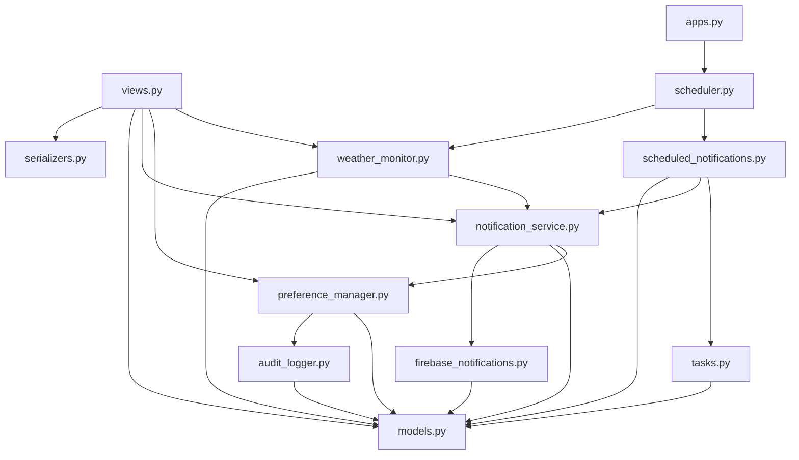

# Project Structure - Backend Weather Forecast System

## Tổng Quan

Dự án Weather Forecast Backend được xây dựng trên Django REST Framework, tuân theo kiến trúc Django App Pattern với tổ chức code rõ ràng theo chức năng. Project sử dụng PostgreSQL làm database, APScheduler cho scheduled tasks, và Firebase Cloud Messaging cho push notifications.

## Cấu Trúc Thư Mục

```
weather_project/
├── .git/                           # Git version control
├── .kiro/                          # Kiro AI assistant configuration
│   ├── specs/                      # Feature specifications
│   └── steering/                   # AI steering rules
├── .pytest_cache/                  # Pytest cache files
├── .venv/                          # Python virtual environment
├── .vscode/                        # VS Code settings
├── api/                            # Main Django app - Core business logic
│   ├── __pycache__/               # Python bytecode cache
│   ├── management/                # Django management commands
│   │   └── commands/              # Custom management commands
│   ├── migrations/                # Database migrations
│   │   ├── 0001_initial.py
│   │   ├── 0002_advicecache.py
│   │   ├── 0003_location_last_weather_check_and_more.py
│   │   ├── 0004_notificationpreferences_weatheralert_and_more.py
│   │   ├── 0005_preferenceauditlog.py
│   │   └── 0006_notificationpreferences_notifications_enabled.py
│   ├── __init__.py
│   ├── admin.py                   # Django admin configuration
│   ├── apps.py                    # App configuration & scheduler startup
│   ├── audit_logger.py            # Audit logging for preference changes
│   ├── firebase_notifications.py  # Firebase Cloud Messaging integration
│   ├── models.py                  # Database models (ORM)
│   ├── notification_service.py    # Notification orchestration service
│   ├── preference_manager.py      # User preference management
│   ├── scheduled_notifications.py # Scheduled notification logic
│   ├── scheduler.py               # APScheduler configuration & jobs
│   ├── serializers.py             # DRF serializers for API
│   ├── tasks.py                   # Background tasks (AI advice generation)
│   ├── tests.py                   # Django default test file
│   ├── urls.py                    # API URL routing
│   ├── views.py                   # API view functions
│   └── weather_monitor.py         # Weather monitoring & alert detection
├── docs/                          # Project documentation
│   ├── ALGORITHMS.md              # Algorithm documentation
│   ├── API_DOCUMENTATION.md       # API endpoint documentation
│   ├── DATABASE.md                # Database schema & ERD
│   ├── FLOWS.md                   # System flow diagrams
│   ├── PROJECT_STRUCTURE.md       # This file
│   └── SYSTEM_DESIGN.md           # System architecture
├── test_unit/                     # Unit tests
│   ├── test_alert_aggregation.py
│   ├── test_audit_logging.py
│   ├── test_device_token_management.py
│   ├── test_notification_history_api.py
│   ├── test_notification_history.py
│   ├── test_notification_integration.py
│   ├── test_notification_preferences_api.py
│   ├── test_notification_service.py
│   ├── test_preference_manager.py
│   ├── test_push_notification.py
│   ├── test_schedule_integration.py
│   ├── test_schedule_logic.py
│   ├── test_scheduled_notifications.py
│   ├── test_scheduler_jobs.py
│   ├── test_scheduler_setup.py
│   └── test_weather_monitoring_integration.py
├── weather_project/               # Django project configuration
│   ├── __pycache__/              # Python bytecode cache
│   ├── __init__.py
│   ├── asgi.py                   # ASGI configuration
│   ├── settings.py               # Django settings
│   ├── urls.py                   # Root URL configuration
│   └── wsgi.py                   # WSGI configuration
├── __pycache__/                  # Root level Python cache
├── .env                          # Environment variables (not in git)
├── .env.example                  # Environment variables template
├── .gitignore                    # Git ignore rules
├── database.sql                  # Database schema SQL
├── firebase-service-account.json # Firebase credentials (not in git)
├── FIREBASE_SETUP.md             # Firebase setup guide
├── manage.py                     # Django management script
├── OLLAMA_SETUP_GUIDE.md         # Ollama AI setup guide
├── pytest.ini                    # Pytest configuration
├── QUICK_FIREBASE_SETUP.md       # Quick Firebase setup
├── README.md                     # Project overview & quick start
└── requirements.txt              # Python dependencies
```

## Mô Tả Chi Tiết Các Thư Mục

### 1. `api/` - Main Application

Đây là Django app chính chứa toàn bộ business logic của hệ thống.

#### Core Files

- **`models.py`**: Định nghĩa các database models (User, Location, WeatherData, WeatherAlert, NotificationPreferences, etc.)
- **`views.py`**: Chứa các API view functions xử lý HTTP requests
- **`urls.py`**: Định nghĩa URL routing cho các API endpoints
- **`serializers.py`**: DRF serializers để serialize/deserialize data giữa JSON và Python objects

#### Service Layer

- **`notification_service.py`**: Service orchestration cho notification system, điều phối giữa các components
- **`firebase_notifications.py`**: Low-level Firebase Cloud Messaging integration, gửi push notifications
- **`weather_monitor.py`**: Monitor weather data và detect extreme events/alerts
- **`scheduled_notifications.py`**: Logic cho scheduled notifications (morning summary, weekly forecast)
- **`preference_manager.py`**: Quản lý user preferences với validation và audit logging
- **`audit_logger.py`**: Ghi log các thay đổi preferences cho audit trail

#### Background Processing

- **`scheduler.py`**: Cấu hình APScheduler, định nghĩa scheduled jobs (weather monitoring, notifications)
- **`tasks.py`**: Background tasks như AI advice generation sử dụng Ollama LLM

#### Configuration

- **`apps.py`**: App configuration, khởi động scheduler khi Django starts
- **`admin.py`**: Django admin interface configuration

#### Database

- **`migrations/`**: Django database migrations, track schema changes theo thời gian
  - `0001_initial.py`: Initial schema
  - `0002_advicecache.py`: Thêm AI advice caching
  - `0003_location_last_weather_check_and_more.py`: Thêm weather check tracking
  - `0004_notificationpreferences_weatheralert_and_more.py`: Notification system
  - `0005_preferenceauditlog.py`: Audit logging
  - `0006_notificationpreferences_notifications_enabled.py`: Global notification toggle

#### Management Commands

- **`management/commands/`**: Custom Django management commands (nếu có)

### 2. `weather_project/` - Django Project Configuration

Chứa các file cấu hình Django project.

- **`settings.py`**: Django settings (database, installed apps, middleware, cache, logging, custom settings)
- **`urls.py`**: Root URL configuration, include app URLs
- **`wsgi.py`**: WSGI entry point cho production deployment
- **`asgi.py`**: ASGI entry point cho async support

### 3. `test_unit/` - Unit Tests

Chứa tất cả unit tests cho hệ thống, sử dụng pytest và pytest-django.

#### Test Categories

**Notification Tests:**
- `test_notification_service.py`: Test notification service orchestration
- `test_push_notification.py`: Test Firebase push notification sending
- `test_notification_preferences_api.py`: Test preference API endpoints
- `test_notification_history_api.py`: Test notification history API
- `test_notification_history.py`: Test notification history logic
- `test_notification_integration.py`: Integration tests cho notification flow

**Scheduler Tests:**
- `test_scheduler_setup.py`: Test scheduler configuration
- `test_scheduler_jobs.py`: Test scheduled job execution
- `test_scheduled_notifications.py`: Test scheduled notification logic
- `test_schedule_logic.py`: Test scheduling algorithms
- `test_schedule_integration.py`: Integration tests cho scheduler

**Weather Monitoring Tests:**
- `test_weather_monitoring_integration.py`: Test weather monitoring & alert detection
- `test_alert_aggregation.py`: Test alert aggregation logic

**Preference Management Tests:**
- `test_preference_manager.py`: Test preference management logic
- `test_audit_logging.py`: Test audit logging functionality

**Device Management Tests:**
- `test_device_token_management.py`: Test FCM device token management

### 4. `docs/` - Documentation

Chứa tất cả technical documentation.

- **`SYSTEM_DESIGN.md`**: System architecture, components, technology stack
- **`DATABASE.md`**: Database schema, ERD, table descriptions
- **`API_DOCUMENTATION.md`**: API endpoint documentation
- **`FLOWS.md`**: System flow diagrams (authentication, notification, data sync)
- **`ALGORITHMS.md`**: Special algorithms (weather monitoring, notification scheduling)
- **`PROJECT_STRUCTURE.md`**: Project structure documentation (file này)

### 5. `.venv/` - Virtual Environment

Python virtual environment chứa tất cả dependencies được cài đặt từ `requirements.txt`.

### 6. `.kiro/` - Kiro AI Configuration

Cấu hình cho Kiro AI assistant.

- **`specs/`**: Feature specifications (requirements, design, tasks)
- **`steering/`**: AI steering rules và guidelines

### 7. Configuration Files

- **`.env`**: Environment variables (secrets, API keys) - KHÔNG commit vào git
- **`.env.example`**: Template cho environment variables
- **`.gitignore`**: Files/folders được git ignore
- **`pytest.ini`**: Pytest configuration
- **`requirements.txt`**: Python package dependencies
- **`manage.py`**: Django management script

### 8. Documentation Files

- **`README.md`**: Project overview, quick start guide
- **`FIREBASE_SETUP.md`**: Chi tiết Firebase setup
- **`QUICK_FIREBASE_SETUP.md`**: Quick Firebase setup guide
- **`OLLAMA_SETUP_GUIDE.md`**: Hướng dẫn setup Ollama AI

### 9. Database Files

- **`database.sql`**: Database schema SQL script
- **`firebase-service-account.json`**: Firebase service account credentials - KHÔNG commit vào git

## Naming Conventions

### Python Files

- **Snake case**: Tất cả Python files sử dụng snake_case (ví dụ: `weather_monitor.py`, `notification_service.py`)
- **Descriptive names**: Tên file mô tả rõ chức năng (ví dụ: `scheduled_notifications.py` thay vì `scheduler_notif.py`)

### Python Classes

- **PascalCase**: Classes sử dụng PascalCase (ví dụ: `WeatherMonitor`, `NotificationService`, `PreferenceManager`)
- **Model names**: Django models sử dụng singular nouns (ví dụ: `User`, `Location`, `WeatherData`)

### Python Functions/Methods

- **Snake case**: Functions và methods sử dụng snake_case (ví dụ: `send_notification()`, `check_weather_alerts()`)
- **Verb-based**: Function names bắt đầu bằng động từ mô tả action (ví dụ: `get_`, `create_`, `update_`, `delete_`, `send_`, `check_`)

### Database Tables

- **Snake case with app prefix**: Django tự động tạo table names theo format `app_modelname` (ví dụ: `api_user`, `api_location`, `api_weatherdata`)
- **Lowercase**: Tất cả table names là lowercase

### API Endpoints

- **Kebab case**: URL paths sử dụng kebab-case (ví dụ: `/api/device-token/register/`, `/api/notifications/preferences/`)
- **RESTful**: Follow RESTful conventions (ví dụ: `/api/locations/` cho list, `/api/locations/<id>/` cho detail)

### Test Files

- **Prefix with `test_`**: Tất cả test files bắt đầu bằng `test_` (ví dụ: `test_notification_service.py`)
- **Descriptive**: Tên file mô tả module hoặc feature được test

### Environment Variables

- **UPPERCASE with underscores**: Environment variables sử dụng UPPERCASE_WITH_UNDERSCORES (ví dụ: `WEATHER_API_KEY`, `DB_NAME`, `ADMIN_SECRET`)

## Modules và Responsibilities

### Core Modules

#### 1. **Data Layer** (`models.py`)
- **Responsibility**: Định nghĩa database schema, ORM models, relationships
- **Dependencies**: Django ORM
- **Key Models**: User, Location, WeatherData, WeatherAlert, NotificationPreferences, DeviceToken

#### 2. **API Layer** (`views.py`, `urls.py`, `serializers.py`)
- **Responsibility**: Handle HTTP requests, validate input, return responses
- **Dependencies**: Django REST Framework, models, services
- **Key Endpoints**: Authentication, Weather, Alerts, Notifications, Location Tracking

#### 3. **Service Layer**
- **`notification_service.py`**: Orchestrate notification flow
  - Dependencies: firebase_notifications, preference_manager, models
- **`firebase_notifications.py`**: Send FCM push notifications
  - Dependencies: firebase_admin, models
- **`weather_monitor.py`**: Monitor weather và detect alerts
  - Dependencies: models, notification_service
- **`scheduled_notifications.py`**: Generate scheduled notifications
  - Dependencies: models, notification_service, tasks
- **`preference_manager.py`**: Manage user preferences
  - Dependencies: models, audit_logger

#### 4. **Background Processing**
- **`scheduler.py`**: Schedule và execute periodic jobs
  - Dependencies: APScheduler, weather_monitor, scheduled_notifications
- **`tasks.py`**: Execute background tasks (AI advice)
  - Dependencies: httpx (Ollama API), models

#### 5. **Utility Modules**
- **`audit_logger.py`**: Log preference changes
  - Dependencies: models

### Module Dependencies Graph



## Technology Stack

### Core Framework
- **Django 5.2.7**: Web framework
- **Django REST Framework 3.16.1**: API framework
- **drf-spectacular 0.28.0**: API documentation

### Database
- **PostgreSQL**: Primary database
- **psycopg2-binary 2.9.11**: PostgreSQL adapter

### Background Processing
- **APScheduler 3.11.0**: Task scheduling
- **django-apscheduler 0.7.0**: Django integration

### Push Notifications
- **firebase-admin 7.1.0**: Firebase Cloud Messaging

### AI Integration
- **httpx 0.28.1**: HTTP client cho Ollama API
- **Ollama**: Local LLM cho AI advice generation

### Testing
- **pytest 9.0.1**: Testing framework
- **pytest-django 4.11.1**: Django integration

### Utilities
- **python-dotenv 1.1.1**: Environment variable management
- **requests 2.32.5**: HTTP library
- **bcrypt 5.0.0**: Password hashing

### Caching
- **Django LocMemCache**: In-memory caching

## Development Workflow

### 1. Setup Environment
```bash
# Create virtual environment
python -m venv .venv

# Activate virtual environment
.venv\Scripts\activate  # Windows
source .venv/bin/activate  # Linux/Mac

# Install dependencies
pip install -r requirements.txt
```

### 2. Database Setup
```bash
# Run migrations
python manage.py migrate

# Create superuser
python manage.py createsuperuser
```

### 3. Run Development Server
```bash
# Start Django development server
python manage.py runserver
```

### 4. Run Tests
```bash
# Run all tests
pytest

# Run specific test file
pytest test_unit/test_notification_service.py

# Run with coverage
pytest --cov=api
```

### 5. Database Migrations
```bash
# Create new migration
python manage.py makemigrations

# Apply migrations
python manage.py migrate

# Show migration status
python manage.py showmigrations
```

## Best Practices

### Code Organization
- **Separation of Concerns**: Tách biệt data layer, service layer, và API layer
- **Single Responsibility**: Mỗi module có một responsibility rõ ràng
- **Dependency Injection**: Services nhận dependencies qua parameters

### Error Handling
- **Try-Except Blocks**: Wrap external API calls và database operations
- **Logging**: Log errors với context information
- **Graceful Degradation**: System tiếp tục hoạt động khi một component fails

### Testing
- **Unit Tests**: Test individual functions và methods
- **Integration Tests**: Test interactions giữa components
- **Test Coverage**: Maintain high test coverage cho critical paths

### Security
- **Environment Variables**: Store secrets trong .env file
- **Authentication**: Require authentication cho protected endpoints
- **Input Validation**: Validate tất cả user inputs
- **SQL Injection Prevention**: Sử dụng Django ORM (parameterized queries)

### Performance
- **Caching**: Cache weather data và AI advice
- **Database Indexing**: Index foreign keys và frequently queried fields
- **Async Processing**: Sử dụng background tasks cho long-running operations

## Maintenance Notes

### Adding New Features
1. Create models trong `models.py` nếu cần
2. Create migrations: `python manage.py makemigrations`
3. Create serializers trong `serializers.py`
4. Create views trong `views.py`
5. Add URL routes trong `urls.py`
6. Write tests trong `test_unit/`
7. Update documentation

### Modifying Database Schema
1. Update models trong `models.py`
2. Create migration: `python manage.py makemigrations`
3. Review migration file
4. Apply migration: `python manage.py migrate`
5. Update tests nếu cần

### Adding Scheduled Jobs
1. Define job function trong `scheduler.py`
2. Add job to scheduler trong `start()` function
3. Test job execution
4. Write tests trong `test_unit/test_scheduler_jobs.py`

## Related Documentation

- [System Design](SYSTEM_DESIGN.md) - System architecture và components
- [Database Schema](DATABASE.md) - Database ERD và table descriptions
- [API Documentation](API_DOCUMENTATION.md) - API endpoint details
- [System Flows](FLOWS.md) - System flow diagrams
- [Algorithms](ALGORITHMS.md) - Special algorithms documentation
- [README](../README.md) - Project overview và quick start

---

**Last Updated**: 2025-01-24
**Maintained By**: Development Team
