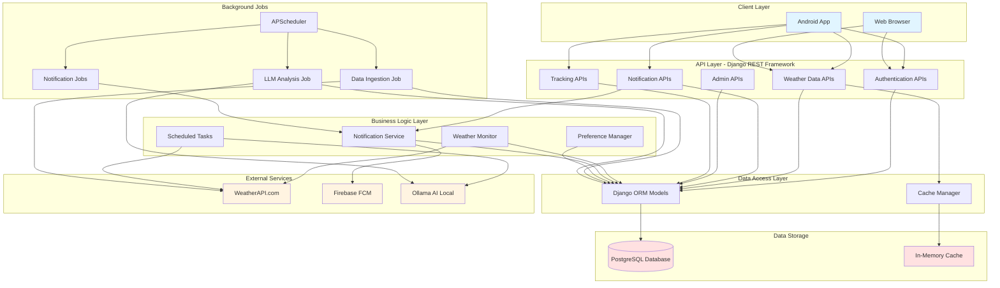
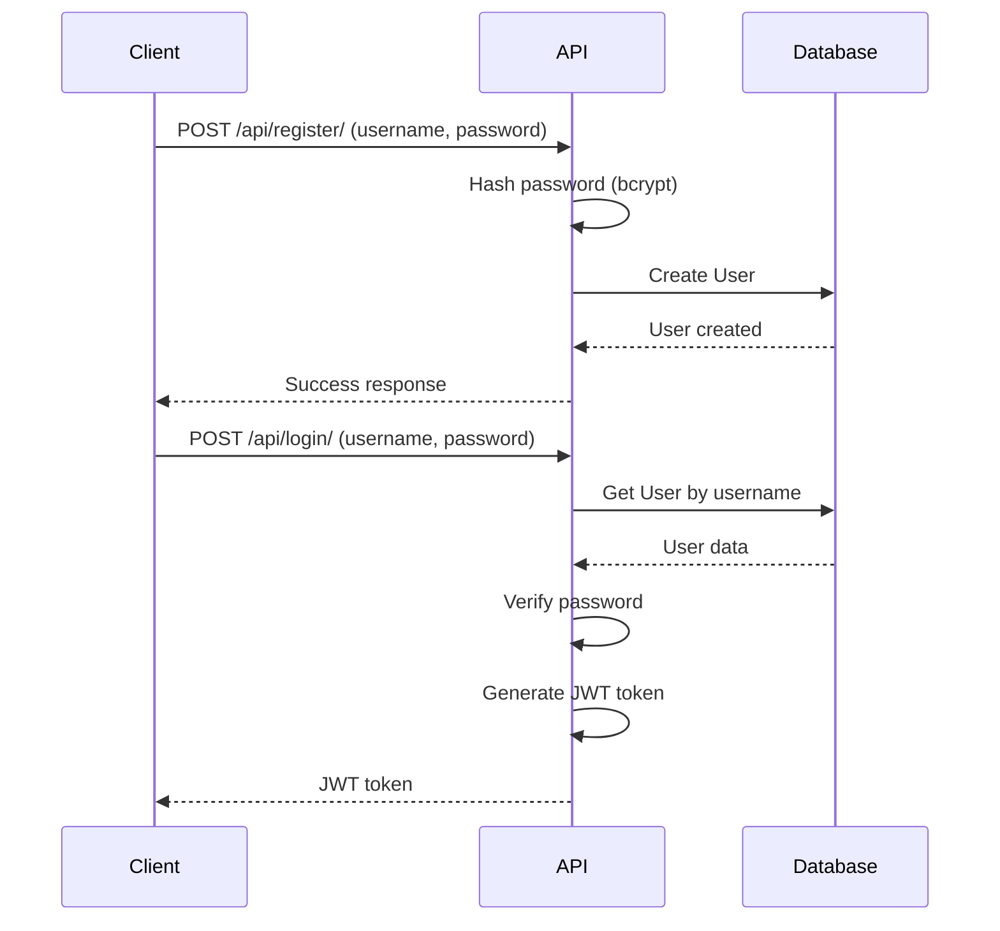
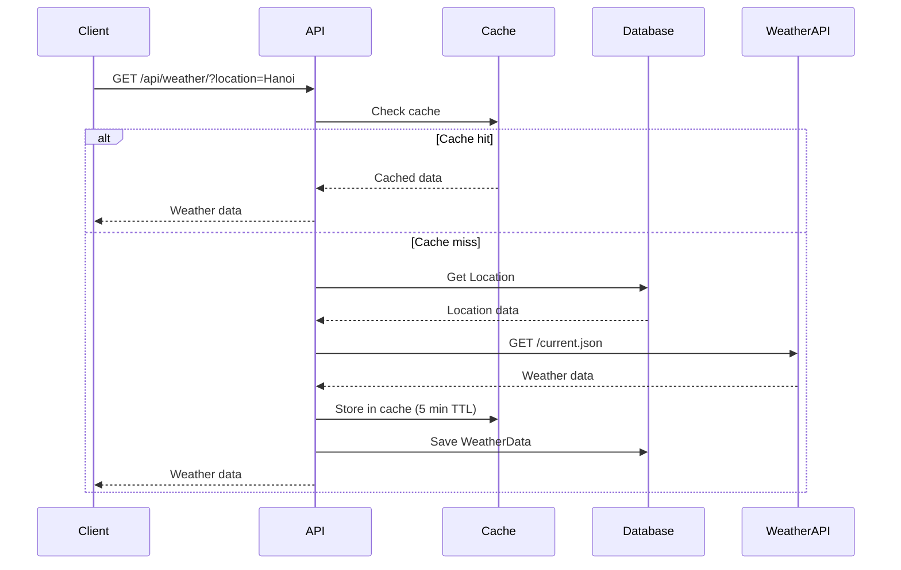
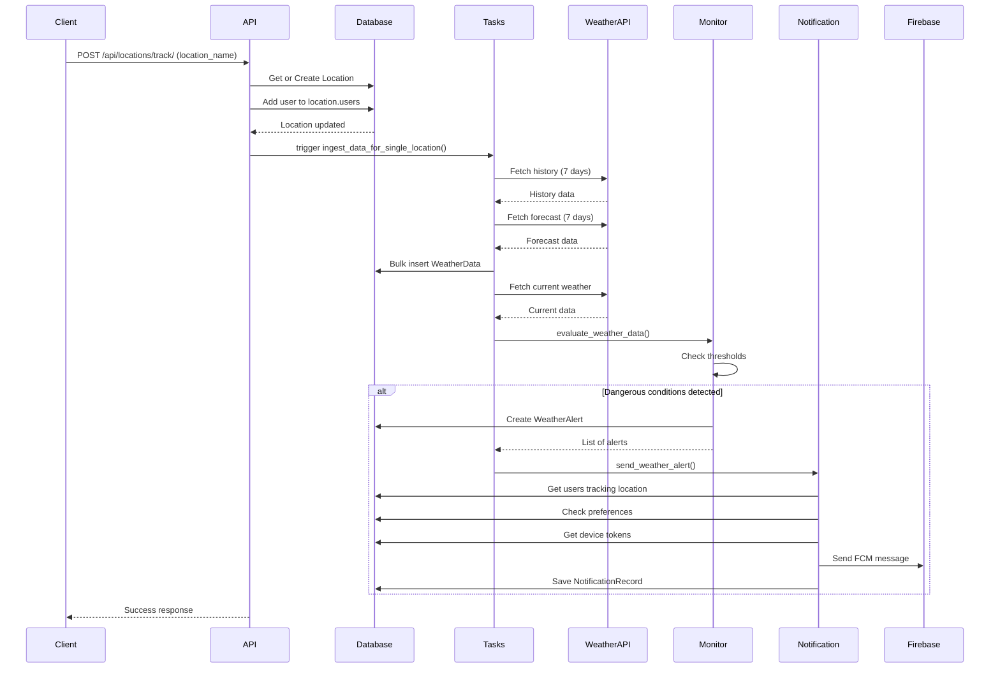
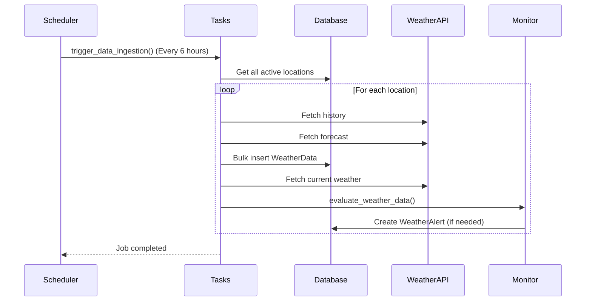
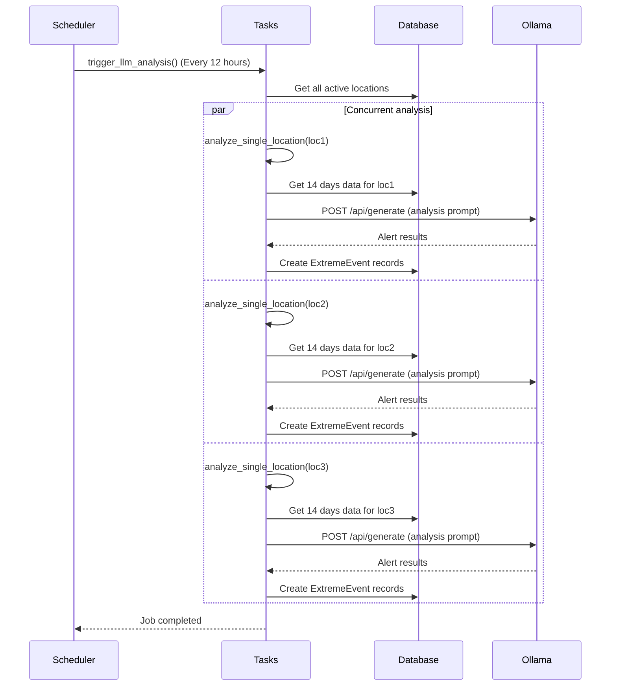
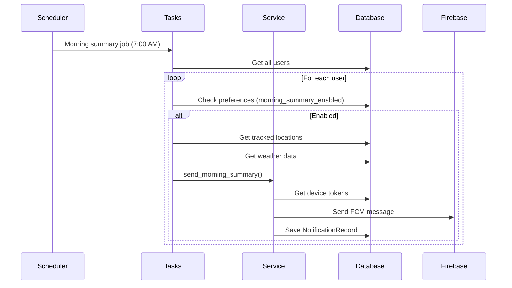

# Thiết kế hệ thống - Weather Forecast Backend

## 📋 Mục lục

- [Tổng quan](#tổng-quan)
- [Kiến trúc tổng thể](#kiến-trúc-tổng-thể)
- [Các tầng và thành phần chính](#các-tầng-và-thành-phần-chính)
  - [1. API Layer](#1-api-layer-presentation-layer)
  - [2. Business Logic Layer](#2-business-logic-layer)
  - [3. Data Access Layer](#3-data-access-layer)
  - [4. Background Jobs Layer](#4-background-jobs-layer)
  - [5. External Services Integration](#5-external-services-integration)
- [Data Flow](#data-flow)
- [Công nghệ sử dụng](#công-nghệ-sử-dụng)
- [Cấu hình hệ thống](#cấu-hình-hệ-thống)
- [Performance & Scalability](#performance--scalability)
- [Security](#security)
- [Deployment Considerations](#deployment-considerations)

## Tổng quan

Hệ thống Weather Forecast Backend là một REST API được xây dựng bằng Django, cung cấp dịch vụ dự báo thời tiết với các tính năng:
- Quản lý người dùng và xác thực
- Thu thập và lưu trữ dữ liệu thời tiết từ WeatherAPI
- Phân tích dữ liệu bằng AI (Ollama) để phát hiện cảnh báo cực đoan
- Gửi thông báo push qua Firebase Cloud Messaging
- Lập lịch tự động thu thập dữ liệu và gửi thông báo định kỳ

## Kiến trúc tổng thể

Hệ thống được thiết kế theo kiến trúc **Layered Architecture** với các tầng rõ ràng:



## Các tầng và thành phần chính

### 1. API Layer (Presentation Layer)

**Mục đích:** Xử lý HTTP requests từ clients và trả về responses

**Thành phần chính:**
- **views.py**: Chứa tất cả API endpoints
- **serializers.py**: Serialize/deserialize dữ liệu JSON
- **urls.py**: Định nghĩa URL routing

**Các nhóm API:**

#### Authentication APIs
- `POST /api/register/` - Đăng ký user mới
- `POST /api/login/` - Đăng nhập và nhận JWT token

#### Weather Data APIs
- `GET /api/weather/` - Lấy dữ liệu thời tiết cho location
- `GET /api/alerts/` - Lấy danh sách cảnh báo
- `GET /api/advice/` - Lấy lời khuyên AI
- `GET /api/check-advice/` - Kiểm tra lời khuyên gần đây

#### Location Tracking APIs
- `POST /api/locations/track/` - Theo dõi location mới
- `GET /api/locations/tracked/` - Lấy danh sách locations đang theo dõi
- `DELETE /api/locations/delete/` - Xóa location khỏi danh sách theo dõi

#### Notification APIs
- `POST /api/device-token/register/` - Đăng ký FCM device token
- `GET/PUT /api/notifications/preferences/` - Quản lý preferences thông báo
- `GET/PUT /api/notifications/preferences/location/<id>/` - Preferences cho từng location
- `GET /api/notifications/history/` - Lịch sử thông báo
- `GET /api/notifications/preferences/audit-logs/` - Audit logs

#### Admin APIs
- `POST /api/admin/<action>/` - Các hành động admin (trigger jobs, cleanup)

### 2. Business Logic Layer

**Mục đích:** Xử lý logic nghiệp vụ phức tạp

#### Weather Monitor (`weather_monitor.py`)
**Chức năng:**
- Giám sát điều kiện thời tiết theo thời gian thực
- Phát hiện các điều kiện nguy hiểm (mưa to, bão, nắng nóng, rét đậm)
- Tạo WeatherAlert khi phát hiện nguy cơ
- Kiểm tra thay đổi điều kiện thời tiết

**Ngưỡng cảnh báo:**
- Mưa to: > 10mm/giờ hoặc > 50mm/ngày
- Bão: Gió > 50 km/h
- Nắng nóng: Nhiệt độ > 37°C
- Rét đậm: Nhiệt độ < 10°C

#### Notification Service (`notification_service.py`)
**Chức năng:**
- Gửi thông báo push qua Firebase FCM
- Kiểm tra preferences của user trước khi gửi
- Lưu lịch sử thông báo
- Xử lý queue thông báo

**Loại thông báo:**
- Alert notifications (cảnh báo khẩn cấp)
- Morning summary (tóm tắt buổi sáng)
- Tomorrow forecast (dự báo ngày mai)
- Weekly summary (tóm tắt tuần)

#### Preference Manager (`preference_manager.py`)
**Chức năng:**
- Quản lý preferences thông báo của user
- Validate preferences
- Ghi audit log khi có thay đổi
- Kiểm tra xem user có muốn nhận thông báo không

#### Scheduled Notifications (`scheduled_notifications.py`)
**Chức năng:**
- Tạo thông báo định kỳ (buổi sáng, tối, tuần)
- Tổng hợp dữ liệu thời tiết
- Tạo nội dung thông báo phù hợp

### 3. Data Access Layer

**Mục đích:** Quản lý truy cập dữ liệu

#### Django ORM Models (`models.py`)
**Các models chính:**
- `User` - Thông tin người dùng
- `Location` - Địa điểm theo dõi
- `DeviceToken` - FCM tokens
- `WeatherData` - Dữ liệu thời tiết (lịch sử + dự báo)
- `ExtremeEvent` - Sự kiện cực đoan từ AI
- `AdviceCache` - Cache lời khuyên AI
- `NotificationPreferences` - Preferences thông báo global
- `LocationNotificationPreferences` - Preferences cho từng location
- `WeatherAlert` - Cảnh báo thời tiết
- `NotificationRecord` - Lịch sử thông báo
- `QueuedNotification` - Thông báo chờ gửi
- `PreferenceAuditLog` - Audit log preferences

#### Cache Manager
**Chức năng:**
- Cache dữ liệu thời tiết (TTL: 5 phút)
- Cache lời khuyên AI
- Giảm số lần gọi API bên ngoài

### 4. Background Jobs Layer

**Mục đích:** Thực hiện các tác vụ định kỳ và nền

#### APScheduler (`scheduler.py`)
**Các jobs được lập lịch:**

1. **Data Ingestion Job** (Mỗi 6 giờ)
   - Thu thập dữ liệu lịch sử (7 ngày)
   - Thu thập dữ liệu dự báo (7 ngày)
   - Lưu vào database
   - Trigger weather monitoring

2. **LLM Analysis Job** (Mỗi 12 giờ)
   - Phân tích 14 ngày dữ liệu
   - Gọi Ollama AI để phát hiện rủi ro
   - Lưu ExtremeEvent vào database
   - Chạy song song cho nhiều locations

3. **Morning Summary Job** (7:00 AM)
   - Tạo tóm tắt thời tiết buổi sáng
   - Gửi cho users đã bật preferences

4. **Tomorrow Forecast Job** (8:00 PM)
   - Tạo dự báo ngày mai
   - Gửi cho users đã bật preferences

5. **Weekly Summary Job** (Chủ nhật 6:00 PM)
   - Tạo tóm tắt thời tiết tuần
   - Gửi cho users đã bật preferences

#### Tasks Module (`tasks.py`)
**Các hàm chính:**
- `trigger_data_ingestion()` - Thu thập dữ liệu cho tất cả locations
- `ingest_data_for_single_location()` - Thu thập cho 1 location
- `trigger_llm_analysis()` - Phân tích AI song song
- `analyze_single_location()` - Phân tích 1 location
- `call_weather_api_from_task()` - Gọi WeatherAPI
- `call_local_ai_for_analysis()` - Gọi Ollama AI
- `call_local_ai_for_advice()` - Lấy lời khuyên AI

### 5. External Services Integration

#### WeatherAPI.com
**Endpoints sử dụng:**
- `/current.json` - Thời tiết hiện tại
- `/forecast.json` - Dự báo 7 ngày
- `/history.json` - Dữ liệu lịch sử

**Dữ liệu thu thập:**
- Nhiệt độ (temp_c)
- Độ ẩm (humidity)
- Chỉ số UV (uv_index)
- Tốc độ gió (wind_kph)
- Lượng mưa (precip_mm)
- Điều kiện thời tiết (condition)

#### Firebase Cloud Messaging (FCM)
**Chức năng:**
- Gửi push notifications đến Android app
- Sử dụng HTTP v1 API
- Service account authentication

**Cấu trúc message:**
```json
{
  "message": {
    "token": "device_token",
    "notification": {
      "title": "Tiêu đề",
      "body": "Nội dung"
    },
    "data": {
      "type": "alert",
      "location_id": "123",
      "alert_id": "456"
    },
    "android": {
      "priority": "high"
    }
  }
}
```

#### Ollama AI (Local)
**Model sử dụng:** gemma3:4b

**Chức năng:**
1. **Phân tích cảnh báo cực đoan:**
   - Input: 14 ngày dữ liệu thời tiết
   - Output: Mảng các cảnh báo (severity, impact_field, forecast_details_vi, actionable_advice_vi)
   - Phát hiện: Cháy rừng, sốc nhiệt, sâu bệnh

2. **Tạo lời khuyên:**
   - Input: Dữ liệu thời tiết 2-3 ngày tới
   - Output: Lời khuyên hoặc cảnh báo (type, message_vi)
   - Phát hiện: Lũ lụt, mưa to, nắng nóng, gió mạnh, rét đậm


## Data Flow

### 1. User Registration & Authentication Flow



### 2. Weather Data Retrieval Flow



### 3. Location Tracking Flow



### 4. Scheduled Data Ingestion Flow



### 5. AI Analysis Flow



### 6. Notification Flow



## Công nghệ sử dụng

### Core Framework
- **Django 5.2.7** - Web framework chính
- **Django REST Framework 3.16.1** - REST API framework
- **PostgreSQL** (via psycopg2-binary 2.9.11) - Database chính

### Authentication & Security
- **PyJWT 2.10.1** - JWT token generation/validation
- **bcrypt 5.0.0** - Password hashing
- **cryptography 46.0.3** - Cryptographic operations

### Background Jobs & Scheduling
- **APScheduler 3.11.0** - Job scheduling
- **django-apscheduler 0.7.0** - Django integration cho APScheduler

### External API Integration
- **requests 2.32.5** - HTTP client
- **httpx 0.28.1** - Async HTTP client
- **firebase-admin 7.1.0** - Firebase Cloud Messaging

### Google Cloud Services
- **google-auth 2.43.0** - Google authentication
- **google-cloud-firestore 2.21.0** - Firestore client
- **google-cloud-storage 3.6.0** - Cloud Storage client
- **grpcio 1.76.0** - gRPC protocol

### API Documentation
- **drf-spectacular 0.28.0** - OpenAPI 3.0 schema generation
- **uritemplate 4.2.0** - URI template parsing

### Testing
- **pytest 9.0.1** - Testing framework
- **pytest-django 4.11.1** - Django integration cho pytest

### Utilities
- **python-dotenv 1.1.1** - Environment variables management
- **PyYAML 6.0.3** - YAML parsing
- **colorama 0.4.6** - Colored terminal output

### Data Processing
- **msgpack 1.1.2** - Binary serialization
- **jsonschema 4.25.1** - JSON schema validation

### Timezone & Localization
- **tzdata 2025.2** - Timezone database
- **tzlocal 5.3.1** - Local timezone detection

## Cấu hình hệ thống

### Environment Variables
```
# Django
DJANGO_SECRET_KEY=<secret-key>
DJANGO_DEBUG=True/False

# Database
DB_NAME=<database-name>
DB_USER=<database-user>
DB_PASSWORD=<database-password>
DB_HOST=localhost
DB_PORT=5432

# External APIs
WEATHER_API_KEY=<weatherapi-key>
ADMIN_SECRET=<admin-secret>

# Logging
DJANGO_LOG_LEVEL=INFO
```

### Cache Configuration
- **Backend:** In-memory (django.core.cache.backends.locmem.LocMemCache)
- **TTL:** 300 seconds (5 minutes)
- **Location:** weather-cache-local

### Scheduler Configuration
- **Datetime Format:** "N j, Y, f:s a"
- **Run Now Timeout:** 25 seconds

### Firebase Configuration
- **Service Account:** firebase-service-account.json
- **API:** HTTP v1 API

### Ollama Configuration
- **API URL:** http://localhost:11434/api/generate
- **Model:** gemma3:4b
- **Timeout:** 300 seconds (5 minutes)
- **Keep Alive:** 1 hour

## Performance & Scalability

### Caching Strategy
- Weather data được cache 5 phút
- AI advice được cache trong database (AdviceCache)
- Giảm số lần gọi external APIs

### Concurrent Processing
- LLM analysis chạy song song với ThreadPoolExecutor (max 3 workers)
- Tăng tốc độ phân tích cho nhiều locations

### Database Optimization
- Indexes trên các trường thường xuyên query (location, record_time, user)
- Unique constraints để tránh duplicate data
- Bulk insert cho weather data

### Error Handling
- Retry logic cho external API calls
- Timeout configuration cho tất cả network requests
- Graceful degradation khi external services không available
- Comprehensive logging cho debugging

## Security

### Authentication
- JWT-based authentication
- Password hashing với bcrypt
- Token expiration

### API Security
- Admin endpoints yêu cầu admin secret
- User-specific data filtering
- Input validation

### Data Privacy
- User data isolation
- Audit logging cho preference changes
- Secure storage của sensitive data (passwords, tokens)

## Deployment Considerations

### Production Checklist
- [ ] Set DEBUG=False
- [ ] Configure proper SECRET_KEY
- [ ] Set up production database (PostgreSQL)
- [ ] Configure ALLOWED_HOSTS
- [ ] Set up proper logging
- [ ] Configure static files serving
- [ ] Set up HTTPS
- [ ] Configure Firebase service account
- [ ] Set up Ollama service
- [ ] Configure APScheduler for production
- [ ] Set up monitoring and alerting

### Monitoring
- Application logs (Django logging)
- APScheduler job logs
- External API call monitoring
- Database query performance
- Cache hit/miss rates
- FCM delivery rates

### Backup Strategy
- Regular database backups
- Configuration files backup
- Firebase service account backup
- Environment variables documentation

---

**Tài liệu liên quan:**
- [Database Schema](./DATABASE.md)
- [API Documentation](./API_DOCUMENTATION.md)
- [README](../README.md)
